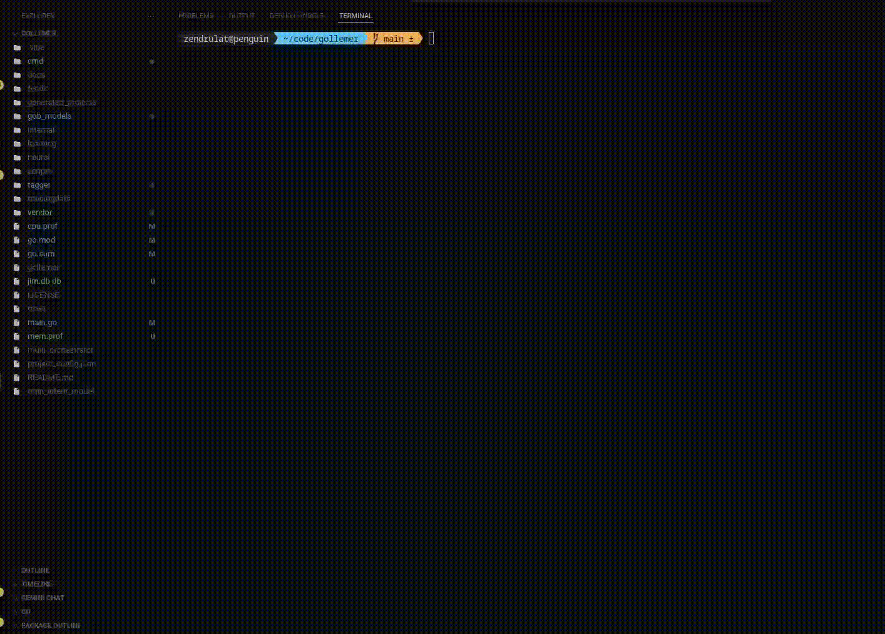

# gollemer: LLM Command-line Utility


### Beta
This project is in beta and changes daily. I once in a while upload youtube [videos](https://www.youtube.com/watch?v=8paxWwPt4-A&list=PL_sE11fwtBT-0GqVHEX-tYTBzAIGHelQ6) talking about its changes.

This project provides a command-line utility for interacting with Large Language Model (LLM) functionalities, enabling natural language interaction for various tasks.

## 🏛️ Architecture Overview

The `gollemer` CLI processes natural language user input through an LLM interface, which then dispatches commands to a robust command processor. This processor leverages a sophisticated Natural Language Processing (NLP) pipeline for understanding user intent and entities. Based on this understanding, it orchestrates either code generation tasks or direct file system operations.

```
+-------------------+       +--------------------+       +---------------------+
|   User Input      | ----> |  LLM Interface     | ----> |  Command Processor  |
| (Natural Language)|       | (Text/Voice)       |       |                     |
+-------------------+       +--------------------+       +----------+----------+
                                                                     |
                                                                     v
+---------------------+    +--------------------+    +-----------------------+
|  NLP Pipeline       | <--| Intent Classifier  |    |  Code Generation      |
| (Intent, NER,        |    | (MoE Model)        |    |  (Templates, DB, etc.)|
| Semantic Parsing)   |    +--------------------+    +-----------------------+
+----------+----------+
           |
           v
+-------------------------+
|  File System Operations |
| (Create, Delete, List)  |
+-------------------------+
```

### Installation

1.  **Clone the repository:**

    ```bash
    git clone https://github.com/golangast/gollemer.git
    
    cd gollemer

    go mod tidy
    ```

## 🛠️ Usage

You may need to retrain the model before using the LLM mode.

The main executable (`main.go`) controls all operations using specific command-line flags. All commands should be run from the root directory of the project.

### 1. Training Models

Use the respective flags to initiate the training process. Each flag executes a separate module located in the `cmd/` directory.

| Model | Flag | Command |
| :--- | :--- | :--- |
| **Word2Vec** | `--train-word2vec` | `go run main.go --train-word2vec` |
| **Mixture of Experts (MoE)** | `--train-moe` | `go run main.go --train-moe` |
| **Intent Classifier** | `--train-intent-classifier` | `go run main.go --train-intent-classifier` |

<p align="center">
    
</p>

### 2. LLM Interactive Mode

The LLM Interactive Mode allows you to interact with the `gollemer` CLI using natural language. The system's underlying NLP pipeline (detailed further in `docs/index.html`) interprets your commands to perform tasks such as file system operations and code generation.

To run the LLM utility in interactive mode, use the following command from the project root:

```bash
go run . -llm
```

Once in interactive mode, you can type natural language commands directly. The CLI will attempt to understand your intent and execute the corresponding action.

#### LLM Interactive Mode Commands

Here are the commands you can use in the interactive LLM mode:

| Command | Description | Example Prompt |
| :------ | :---------- | :------------- |
| **Change Directory** | Navigates to a specified directory. The `gollemer` remembers the last directory you navigated to. | `go to myproject` <br> `cd src` |
| **List Directory Contents** | Lists files, folders, or both in the current directory or a specified path. | `list all files` <br> `list folders` <br> `ls` |
| **Create Folder** | Creates a new directory. | `create folder mydata` <br> `create folder temp in /tmp` |
| **Create File** | Creates a new empty file. | `create file README.md` <br> `create file test.txt in src` |
| **Create Handler** | Generates a new Go HTTP handler function and registers it in `main.go`. | `create handler MyHandler with url /myapi` |
| **Create Webserver** | Scaffolds a new Go web server project in `cmd/<name>/main.go`. | `create webserver MyServer` |
| **Create Database** | Creates a SQLite database file and optionally a table with specified fields. | `create database myappdb` <br> `create database myappdb with the fields name string and age int` |
| **Create Data Structure** | Creates a Go struct file and a corresponding table in a SQLite database (`jim.db`). | `create data structure User with field Name string and Age int` |
| **Delete Folder** | Deletes a specified directory. | `delete folder temp` |
| **Delete File** | Deletes a specified file. | `delete file old.txt` |
| **Print Working Directory** | Prints the current working directory. | `pwd` |


### 3. Help / No Action

If no flags are provided, the application will prompt the user to specify an action:

```
$ go run main.go
2025/10/05 07:35:00 No action specified. Use -train-word2vec, -train-moe, -train-intent-classifier, or -llm.
```

-----

## Special thanks
* [Go Team because they are gods](https://github.com/golang/go/graphs/contributors)

## Why Go?
* The language is done since 1.0.https://youtu.be/rFejpH_tAHM there are little features that get added after 10 years but whatever you learn now will forever be useful.
* It also has a compatibility promise https://go.dev/doc/go1compat
* It was also built by great people. https://hackernoon.com/why-go-ef8850dc5f3c
* 14th used language https://insights.stackoverflow.com/survey/2021
* Highest starred language https://github.com/golang/go
* It is also number 1 language to go to and not from https://www.jetbrains.com/lp/devecosystem-2021/#Do-you-plan-to-adopt--migrate-to-other-languages-in-the-next--months-If-so-to-which-ones
* Go is growing in all measures https://madnight.github.io/githut/#/stars/2023/3
* Jobs are almost doubling every year. https://stacktrends.dev/technologies/programming-languages/golang/
* Companies that use go. https://go.dev/wiki/GoUsers
* Why I picked Go https://youtu.be/fD005g07cU4