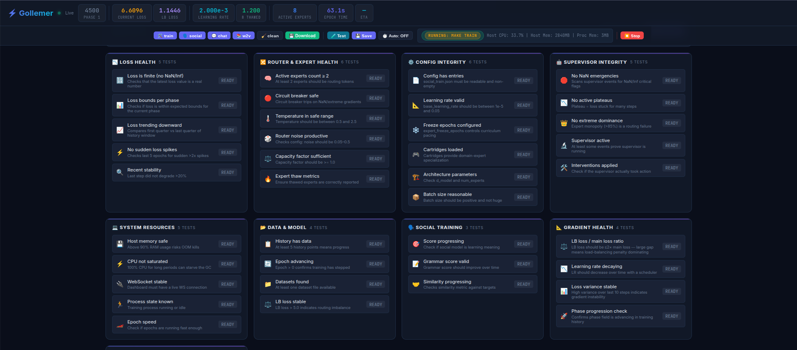
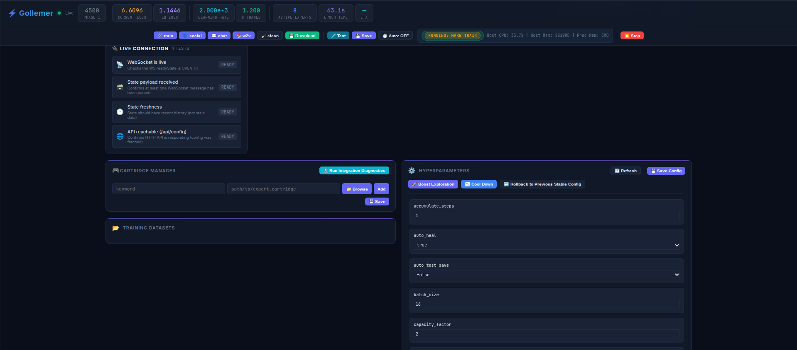

# Gollemer

Gollemer is a high-performance **Mixture of Experts (MoE)** neural network framework and training pipeline written entirely in **Go**. It is designed for maximum performance with **zero external dependencies**, featuring a native core optimized for SIMD-accelerated CPU training and an autonomous adaptive supervisor.

---

## 🚀 Key Features

- **Mixture of Experts Architecture**: Efficient multi-expert routing ($K=1$) for increased model capacity with low inference latency.
- **High Performance**: Native SIMD-vectorized operations for AVX2/SSE/Neon.
- **Autonomous Adaptive Supervisor**: Real-time hyperparameter reflection, self-directed expert spawning/eviction, and on-the-fly training data evolution.
- **Chromebook & Raspberry Pi Ready**: Lightweight enough to train models entirely on Chromebooks, Raspberry Pi 3B, and other low-power commodity devices.
- **Distributed Federated Training**: Two Raspberry Pis can train in parallel over a local Ethernet network. A master Pi runs training and hosts an HTTP weight-sync server; a worker Pi trains independently and streams its weights to the master for federated averaging — no shared storage or message broker required.
- **Stabilized MoE Training**: 
  - **Router Noise & Jitter**: Prevents expert collapse and forces specialization.
  - **Expert Health Monitoring**: Real-time tracking of expert utilization and saturation.
  - **Context Multiplier**: Enhanced signal strength for maintaining long-range conversational threads.
- **Sequence Awareness**: Integrated **Positional Encoding** in the MoE encoder to solve bag-of-words limitations.
- **Word2Vec Semantic Pre-training**: Initializes the embedding layer using Word2Vec to eliminate random weight initialization and provide a strong semantic baseline.
- **Advanced Training Pipeline**:
  - **Social Curriculum**: Specialized training for natural, diverse human-like interaction.
  - **Scheduled Sampling**: Smooth transition from teacher-forcing to self-generated sequence learning.
  - **Robust Model Persistence**: Gzip-compressed checkpoints with legacy fallback support and atomic saving.
- **Dependency-Free Core**: No Python, Rust, PyTorch, C++, or external BLAS (like Gonum/OpenBLAS) required. The entire neural engine is native Go.
- **Hardware-Native Performance**:
  - **CPU**: Native **SIMD acceleration** using Go's `archsimd` (AVX2/SSE/Neon), matching BLAS performance without external C libraries.
- **Ultra-Portable**: Compiles to a single static binary. No shared libraries, virtual environments, or complex environments needed.

---

## 🏗️ Why Gollemer?

By eliminating heavy external libraries like **Rust-based backends**, **Python runtimes**, and **Gonum**, Gollemer achieves a state of absolute "Mechanical Sympathy" with the Go compiler and runtime:
- **Zero External Dependencies**: Built entirely from scratch. No need for Python, CGO, Rust toolchains, LLVM, or complex shared libraries. Just clean, native Go.
- **Chromebook-Ready Performance**: Due to its ultra-lean memory footprint and optimized Go-assembly/SIMD vector math, you can run and train Gollemer models directly on a **Chromebook**, basic laptops, or entry-level edge servers. No massive GPU clusters or gigabytes of VRAM required.
- **Instant Deployment**: Compile once, run anywhere. The entire training suite, tokenizers, world knowledge database, and interactive shell deploy as a single static binary.

---

## 🧠 The Adaptive Supervisor (Self-Evolving MoE)

The most advanced capability of Gollemer is its **Adaptive Supervisor** (`internal/ai/moe/supervisor.go`), an autonomous orchestrator that manages a real-time feedback loop during training. Instead of static hyperparameters and a fixed layout, the supervisor actively monitors, heals, and expands the network architecture dynamically.

### 1. Dynamic Config Tuning & Real-Time Reflection
The supervisor continuously reflects on training statistics (`Reflect` / `ReflectSparse`), assisted by an **Autonomous AI Supervisor Loop**:
*   **Local Qwen Teacher Auditing**: A local Qwen model acts as a teacher to monitor training logs, inject historical epoch performance data, identify mode collapse ("SALAD" output), and dynamically patch hyperparameters in real-time.
*   **Anti-Monopoly Jitter**: If a single expert monopolizes traffic (dominance >85%), the supervisor automatically increases router noise and temperature to force expert exploration and restore healthy specialization.
*   **Plateau Decay**: If training plateaus (perplexity or loss fails to improve for 500–1000 steps), it autonomously decays the global learning rate (`opt.SetLearningRate`) to safely guide weights into a stable minimum.
*   **Confidence Restoration**: If routing confidence falls below a safe threshold (e.g., 18%), it nudges router temperature upward to prevent repetitive "word salad" patterns.
*   **Numerical Safety (Emergency Brake)**: Validates all tensor operations via `SanitizeTensors` to detect and intercept numerical instabilities like `NaN` or `Inf` from failing hardware bridges.

### 2. Autonomous Training Data Evolution
When quality gates or linguistic validations fail on weak or shorthand structures, the supervisor dynamically updates the corpus:
*   **Syntactic Augmentation**: It reads raw training files and mutates weak token fragments (e.g., "hello" or "thanks") on disk into rich grammatical trees containing full Subject-Verb-Object structures (e.g., "i welcome you with hello" or "i offer you my thanks").
*   **Dynamic Sample Weighting**: It reduces the sample weight of grammatically ambiguous training pairs (weight *= 0.5) to prevent them from poisoning the model's loss gradient.
*   **Hot-Injection**: If average similarity falls too low, the supervisor hot-injects highly structured, diverse synthetic conversational patterns directly into the active training loop.

### 3. Self-Directed Expert Spawning, Eviction & Surgery
Gollemer models can dynamically scale their brain capacity during curriculum learning:
*   **Dynamic Spawning**: If an expert combination repeatedly fails (3+ times) under a target intent, the supervisor dynamically spawns a brand new, specialized expert into the MoE layers, automatically extending the gating and noise network weights to handle the new dimensions.
*   **Staggered Triage (Expert Surgery)**: It monitors expert health based on an L2 norm and utilization score. Collapsed or dead experts are triaged and refreshed by cloning the "alpha" (strongest) expert with subtle mutation, while maintaining a ceiling (healing ≤50% per layer) to protect learned sequences.
*   **Active Capacity Eviction**: To prevent memory explosion and out-of-memory (OOM) failures, layers are capped (e.g., 64 experts max). The supervisor evicts the lowest-performing dynamic experts using LRU/health tracking (`EvictLeastActive` or `ForceEvictLowestUtility`), while keeping foundational system experts (E0–E7 representing locked structural grammatical roles like `PRON`, `VERB`, `AUX`) permanently pinned and protected.

## 🔌 Dynamic Expert Cartridges

Gollemer supports **dynamic, hot-swappable expert cartridges** (.cartridge) for memory-constrained environments. Instead of keeping a massive trillion-parameter model in VRAM, Gollemer loads lightweight intent-specific "cartridges" from disk straight into active MoE layers precisely when the user's intent requires them.

### 1. Zero-Copy I/O and LRU Pooling
To prevent Garbage Collection (GC) pauses during cartridge swaps, Gollemer avoids allocating temporary decoding slices. 
- **Zero-Copy Streaming**: Engine memory is managed via a global `sync.Pool`. Tensors from the `.cartridge` binary file are streamed directly into pre-allocated memory blocks.
- **LRU Warm Cache**: A Least-Recently Used (LRU) cache keeps the last $N$ (default: 3) activated cartridges warm in RAM to eliminate latency when bouncing between conversational topics. Unused experts are instantly recycled back into the `sync.Pool`.

### 2. Dual-Triage Streaming Classifier
Gollemer identifies which cartridge to hot-swap **mid-sentence** while the user is still typing, utilizing an Always-On Dual-Triage method:
1. **Zero-Latency Keyword Map**: An O(1) dictionary routing path for explicit intents (e.g., matching "git commit" immediately to the `coding` cartridge).
2. **Tiny Semantic Matrix**: A ultra-lightweight cosine-similarity vector layer that routes nuanced semantic phrasing to the appropriate cartridge when explicit keywords fail.

### 3. The Standardized `.cartridge` Format & CLI
Cartridges are strictly typed binary files. They start with a standard header (`GLMR_CRT`, Engine Version, 32-byte Namespace identifier, and Tensor Dimensions), enabling a modular open ecosystem.

You can compile any trained `FeedForwardExpert` `.gob` snapshot into a shareable `.cartridge` module using the built-in compiler:

```bash
# Compile a raw weights file into a standardized cartridge
go run ./cmd/tools/compile_cartridge/main.go \
    -weights="data/models/gob_models/coding_experts.gob" \
    -namespace="coding" \
    -out="data/models/intents/coding.cartridge"
```


Step 1: Use the -data flag to point the trainer at your computer.csv file.

```bash
go run ./cmd/tools/train_moe -train-social -data "data/training/trainingdata/computer/computer.csv" -epochs 100
```

This updates data/models/gob_models/moe_social_model.gob with the newly learned computer capabilities.

Step 2: Extract the Trained Expert
I have created a new CLI tool for you called extract_cartridge. It isolates a single trained expert from the full model checkpoint so it can be packaged:

```bash
go run ./cmd/tools/extract_cartridge/main.go     -model="data/models/gob_models/moe_social_model.gob"     -expert=0     -out="data/models/gob_models/computer_expert.gob"
```

- `-expert=0`: Targets the 1st expert (index 0). Adjust this number if you want a different expert.
- This creates a clean `computer_expert.gob` file containing only the weights for that specific expert, ready to be used by the Supervisor or Cartridge Loader.

Step 3: Compile into a Standardized .cartridge
Use the compiler tool to wrap the raw weights into the highly optimized .cartridge specification, assigning it the computer namespace:

```bash
go run ./cmd/tools/compile_cartridge/main.go \
    -weights="data/models/gob_models/computer_expert.gob" \
    -namespace="computer" \
    -out="data/models/intents/computer.cartridge"
```

Step 4: Add the Routing Metadata (Zero Code Changes)
Open the newly generated file data/config/cartridges.json. Add your keywords mapped to the new cartridge path so Gollemer knows exactly when to hot-swap it into RAM:

```json
{
  "create file": "data/models/intents/computer.cartridge",
  "touch": "data/models/intents/computer.cartridge",
  "make file": "data/models/intents/computer.cartridge",
  "directory": "data/models/intents/computer.cartridge",
  "folder": "data/models/intents/computer.cartridge",
  "medical": "data/models/intents/medical.cartridge",
  "database": "data/models/intents/database.cartridge"
}
```

Now to use it in the LLM (with voice)

```bash
go run cmd/tools/train_moe/main.go -llm -talk -listen -cartridges="data/models/intents/computer.cartridge"
```

Now, the moment a user types "how do i create a file", the Always-On Triage Classifier will instantly match the keyword, hot-swap computer.cartridge directly into the neural network using the zero-copy buffer pool, and route the generation through your newly trained expert!


---

## ⚡ Quick Start


### 1. Installation
Gollemer requires **Go 1.26+** to leverage native SIMD acceleration.

```bash
git clone https://github.com/golangast/gollemer
cd gollemer
# Enable SIMD experiments for maximum CPU performance
export GOEXPERIMENT=simd 
go mod tidy
```

### 2. Training the Model
We provide a simplified `Makefile` to handle the curriculum training process.

```bash
# Start the Social Curriculum Training (Reset state & begin)
make train

# Start the Social Curriculum Training (Reset state & begin) and add custom data
make train ARGS='-cartridges="data/models/intents/computer.cartridge" -data "data/training/trainingdata/computer/computer.csv"'
```

```bash
# Train word2vec
make word2vec
```

### 3. Running the LLM
Chat with your trained model using the interactive shell.

```bash
# Launch the interactive assistant (with text, voice listening, and TTS output enabled)
make chat
# or use 'make llm'
```

```bash
# Launch the interactive assistant (with text, voice listening, and TTS output enabled)
make dashboard
```




## 🩺 Integrity Test Suite & Dashboard Diagnostics

Gollemer includes a comprehensive, fully synchronous **Integrity Test Suite** accessible directly from the dashboard. This diagnostic pipeline runs critical safety, mathematical, and network health checks to ensure the training environment remains completely stable.

The suite features heavy structural optimizations and live telemetry tracking across 9 major testing categories:

### 1. Robust Core Optimizations
* **Infinite Recursion Protection:** The test grid's rendering engine utilizes a decoupled `buildCategoryHTML` pipeline to eliminate layout-blocking infinite loops during heavy UI updates.
* **Non-Skipped Health Computations:** The master health status bar dynamically computes system health percentages based strictly on active, non-skipped test groups—guaranteeing accurate diagnostics and eliminating mathematical runtime bugs ($NaN$).
* **Cleaned DOM Handlers:** Replaced legacy, broken element references in the interface runner with clean no-op structural guards.

### 2. Expanded Diagnostic Categories
Tests are grouped into distinct testing pillars to give an instantaneous look into deep system behaviors:
* **Gradient Health (New):** Analyzes learning rate decay vectors, loss variance stability over a moving step window, load-balancing loss ratios to flag expert monopolies, and training phase progression to catch chaotic gradients before divergence.
* **Live Connection (New):** Verifies the immediate freshness, API reachability, and structural payload integrity of the underlying WebSocket data stream.
* **Existing Pillars:** Deeper diagnostic coverage across *Loss Health*, *Router & Expert Health*, *Config Integrity*, *Supervisor Integrity*, *System Resources*, *Data & Model*, and *Social Training*.

### 3. Live Detail UI Context
Instead of nesting critical diagnostics inside hover tooltips or freezing them as static descriptions, tests now explicitly push live, real-time metrics (e.g., `Loss = 1.352` or `Temp = 1.800`) directly into their inline detail rows in the UI dashboard.

### 4. Advanced CLI Flags
When running the `train_moe` binary directly, you can use several flags to customize training and inference:

```bash
# Provide custom training data path (CSV, JSON, TXT)
go run ./cmd/tools/train_moe -train-social -data "data/custom_training_set.csv"

# Hot-swap expert cartridges on the fly for LLM inference
go run ./cmd/tools/train_moe -llm -cartridges "data/models/gob_models/medical_experts.gob"

# Mount expert cartridges permanently before training
go run ./cmd/tools/train_moe -train-chat -cartridges "data/models/gob_models/medical_experts.gob,data/models/gob_models/database_experts.gob"
```

---

## 🎙️ Voice Command Pipeline (Pure Go — No CGO)

Gollemer includes a fully self-contained, dependency-free voice command recognition system. It uses a custom `AudioEncoder` + `TemporalEncoder` (GRU) architecture trained entirely in Go, with no Whisper, no PortAudio, and no CGO bindings required.

The pipeline has four stages:

```
record_audio → train_audio → voice_capture → add_command (zero-shot)
```

### Stage 1 — Record Training Samples

Use `record_audio` to capture raw 16kHz PCM samples for each voice command you want to recognise. Requires `ffmpeg` on your system.

```bash
# Record 3–5 samples per intent for good accuracy
go run cmd/tools/record_audio/main.go TURN_ON_LIGHTS 1
go run cmd/tools/record_audio/main.go TURN_ON_LIGHTS 2
go run cmd/tools/record_audio/main.go TURN_ON_LIGHTS 3
go run cmd/tools/record_audio/main.go TURN_OFF_FAN 1
go run cmd/tools/record_audio/main.go TURN_OFF_FAN 2
```

Samples are saved to `dataset/audio/<INTENT_NAME>_<number>.raw`.

### Stage 2 — Train the Audio GRU

Train the `AudioEncoder` + `TemporalEncoder` (GRU) on your recorded samples. The trainer auto-balances classes, finds the loudest 1-second window per sample, runs backpropagation, and saves a prototype embedding for each command.

```bash
go run cmd/tools/train_audio/main.go
```

If no real samples exist in `dataset/audio/`, it falls back to synthetic sine-wave and white-noise data so the pipeline always runs. The trained model is saved to `models/audio_gru.json`.

### Stage 3 — Run the Live Voice Capture Loop

`voice_capture` opens an ALSA microphone via `ffmpeg`, streams 25 ms PCM frames through a 1-second rolling window, and classifies each window using the trained GRU + cosine-similarity prototype matching.

```bash
go run cmd/tools/voice_capture/main.go
```

- Requires `ffmpeg` and an ALSA microphone (`default` device).
- Falls back to a simulated silence stream if no microphone is available.
- **Speaking-Mute Mechanism**: Automatically silences the microphone listener during LLM Text-to-Speech output to prevent self-triggering and audio-feedback loops.
- **Smart Filtering**: Prints detected intents with confidence scores (threshold >= 0.93); suppresses low-confidence, silence, and high-frequency garbage phrases (e.g., `BLANK_AUDIO`).

```
🎧 Listening...
🤖 Audio GRU: TURN_ON_LIGHTS (Confidence: 0.94, RMS: 0.042)
```

### Stage 4 — Add New Commands Without Retraining

`add_command` registers a brand-new voice command by computing its GRU prototype embedding from a few live recordings and appending it to the saved model JSON — **no retraining required**.

```bash
go run cmd/tools/add_command/main.go "TURN OFF FAN"
go run cmd/tools/add_command/main.go "WHAT IS THE WEATHER"
```

The tool guides you through 3 recordings, computes a normalised mean prototype embedding, and patches `models/audio_gru.json` in place so all existing weights are preserved.

> **Note:** The voice capture loop uses **cosine similarity** against stored prototypes, so zero-shot commands work immediately after `add_command` finishes — no restart needed if you reload the model.

---

## 👁️ Vision Capture Pipeline

Gollemer includes a real-time vision processing pipeline built on `go4vl` for Linux kernel camera devices. It captures MJPEG frames, extracts geometric motion tokens (centre-of-mass, variance), and classifies motion sequences using the same `TemporalEncoder` GRU used in audio.

```bash
go run cmd/tools/vision_capture/main.go
```

**Live camera mode** (requires `/dev/video0`, e.g. a USB webcam):
- Opens the camera at 224×224 MJPEG via `go4vl`.
- Extracts a 4-float geometric token (`[CoM-x, CoM-y, var-x, var-y]`) from each frame.
- Pushes tokens into a 4-frame ring buffer and classifies the sequence every 250 ms.

```
[Vision] PAN_RIGHT  (CoM-x=0.621 CoM-y=0.489)
```

**File fallback mode** (no camera required):
- Reads images (`.png`, `.jpg`) and videos (`.mp4`, `.webm`) from the `video/` directory.
- Feeds each file through the MotionWindow to demonstrate the full pipeline.
- Also demonstrates ViT patch extraction (16×16 patches → 256-float feature maps).

**Recognised motion classes:** `PAN_RIGHT`, `PAN_LEFT`, `STATIC`, `TILT_UP`, `TILT_DOWN`, `ZOOM_IN`, `ZOOM_OUT`, `REAL_IMAGE`, `REAL_VIDEO`.

> **Dependency:** `go4vl` requires Linux (`/dev/video*` V4L2 support). The file-fallback path requires `ffmpeg` for video frame extraction.

---

## 🧠 Long-Term Vector Memory (VectorDB)

Gollemer includes a lightweight, RAM-resident vector database (`internal/ai/memory/vectordb.go`) for stateful, long-term conversational awareness. It uses n-gram hashing and L2 normalisation — no external database or embedding model required.

**How it works:**
- **Ingestion**: Any statement prefixed with `"remember"` during voice or chat interaction is embedded using n-gram hashing and stored in a local JSON file (`data/memory/facts.json`).
- **Retrieval**: Before processing each intent, the system queries the `VectorDB` for the top-K most semantically similar past facts and injects them into the neural query context.
- **Persistence**: The memory store is loaded on startup and saved incrementally, surviving restarts.

This enables the assistant to recall user-defined facts like names, preferences, and prior instructions without any cloud dependency.

---

## 📚 Concept-Guided Code Editing with Book Ingestion

Gollemer can read Go textbooks and extract idioms, patterns, and code structures into a structured **Concept Registry** that guides all code generation. This bridges high-level textbook terminology (e.g. "Worker Pool") directly to the required Go primitive constructs and AST mutation rules.

### Architecture Overview

```
Go Book (Markdown/PDF/TXT)
  → BookIngester parses chapters & code blocks
  → ConceptTemplates extracted: terms, synonyms, required constructs, AST mutations
  → Registered into knowledge.Registry (14 built-in patterns + book-derived patterns)
  → User Command → ConceptMatcher.ExtractConcepts() → concept-augmented prompt
  → LLM generates code following proven patterns from the book
```

### Built-in Concept Registry (14 Patterns)

| Pattern | Required Constructs |
|---|---|
| Worker Pool | `sync.WaitGroup`, `chan`, `go fn()` |
| Caching | `sync.RWMutex`, `map`, `sync.Map` |
| Circuit Breaker | `sync.Mutex`, `time.Time`, `atomic` |
| Rate Limiter | `time.Ticker`, `chan struct{}` |
| Observer/PubSub | `chan`, `sync.Mutex`, `interface{}` |
| Singleton | `sync.Once`, `sync.Mutex` |
| Context Propagation | `context.Context`, `context.WithCancel` |
| Fan-Out | `go fn()`, `sync.WaitGroup`, `chan` |
| Fan-In | `chan`, `go fn()`, `sync.WaitGroup` |
| Pipeline | `chan`, `go fn()` |
| Graceful Shutdown | `os.Signal`, `os/signal`, `context.WithCancel` |
| Connection Pool | `chan`, `sync.Mutex` |
| Retry Pattern | `time.Duration`, `time.Sleep` |
| Dependency Injection | `interface{}`, struct embedding |

### Book Ingestion Commands

```bash
# Ingest a Go book (Markdown format) and extract patterns
go run ./cmd/tools/ingest_book/main.go \
  -file="docs/concurrency-in-go.md" \
  -out="data/knowledge/book_concepts.json"

# Ingest inline text
go run ./cmd/tools/ingest_book/main.go \
  -text="Worker Pools use channels and sync.WaitGroup..." \
  -title="Go Concurrency Patterns"

# Export extracted concepts for reuse
go run ./cmd/tools/ingest_book/main.go \
  -export="data/knowledge/exported_concepts.json"

# Import previously extracted concepts (no re-parsing needed)
go run ./cmd/tools/ingest_book/main.go \
  -import="data/knowledge/exported_concepts.json"
```

### Programmatic Usage

```go
// Create planner with built-in concept registry
planner := NewPlanner(symbolGraph, rootDir, llmEngine)

// Ingest a Go book to learn new patterns
result, err := planner.conceptMatcher.IngestBookFromFile("the-go-programming-language.md")
fmt.Printf("Learned %d concepts from %s\n", len(result.Concepts), result.BookTitle)

// Save for later reuse
planner.conceptMatcher.ExportConcepts("learned_concepts.json")

// Later, reload without re-parsing
planner.conceptMatcher.ImportConcepts("learned_concepts.json")

// Process commands using book-derived + built-in knowledge
plan, _ := planner.GenerateExecutionPlan(ctx, exploration)
// The prompt includes blueprints from both built-in registry AND the book
```

---

## 🔬 Dataset Mining & Training Pipeline

Gollemer includes a complete pipeline for mining real-world Go patches from Git history, converting them into training data, and fine-tuning via Fill-In-The-Middle (FIM) and Compiler-Driven Reinforcement Learning (RLAIF).

### Pipeline Overview

```
1. Dataset Mining:  git log -p → structured training triplets
2. Dataset Builder: triplets → FIM format + SEARCH/REPLACE + augmented examples
3. FIM Training:    <PRE>code<SUF>code<MID> → model learns surgical code insertion
4. RLAIF Loop:      generate patch → go/parser → go vet → go build → reward signal
```

### Step 1: Mine Git Commits into Training Triplets

```bash
# Mine a single repository
go run ./cmd/tools/dataset_miner/main.go \
  -repo="https://github.com/gin-gonic/gin" \
  -out="data/training/gin_patches.json" \
  -max=5000

# Mine multiple repositories
go run ./cmd/tools/dataset_miner/main.go \
  -repo="https://github.com/golang/go" \
  -out="data/training/go_patches.json" \
  -max=10000

go run ./cmd/tools/dataset_miner/main.go \
  -repo="https://github.com/uber-go/zap" \
  -out="data/training/zap_patches.json" \
  -max=5000
```

Output:
- `mined_patches.json` — TrainingTriplets with `instruction`, `before_code`, `target_patch`
- `mined_patches_fim.json` — FIM examples with `prefix`, `suffix`, `middle`
- All patches validated with `go/parser` (invalid Go discarded automatically)

### Step 2: Build Structured Dataset

```bash
# Convert mined patches into training-ready dataset
go run ./cmd/tools/dataset_builder/main.go \
  -in="data/training/gin_patches.json" \
  -out="data/training/fim_dataset.json"

# Custom split ratios
go run ./cmd/tools/dataset_builder/main.go \
  -in="data/training/mined_patches.json" \
  -out="data/training/fim_dataset.json" \
  -val-split=0.15 \
  -test-split=0.05
```

Output dataset includes:
- **FIM examples**: `<PRE>prefix<SUF>suffix<MID>` format for surgical code insertion
- **SEARCH/REPLACE examples**: Full before/after patch pairs
- **Augmented examples**: Concept-tagged examples with required primitives
- **Train/Val/Test splits**: Automatically partitioned

### Step 3: Run FIM Training

```go
// Programmatic usage in Go
config := DefaultFIMConfig()
config.Epochs = 20
config.BatchSize = 16

trainer := NewFIMTrainer(config, moeModel)
err := trainer.TrainFromFile("data/training/fim_dataset.json")
```

### ⚠️ Important: Data Flow — FIM Pipeline vs LLM

The `build-dataset` → `fim_dataset.json` → `train-fim` pipeline is **isolated** from the LLM (`make chat` / `-llm`) by default:

```
make mine-dataset REPO=...   →   data/training/mined_patches.json
       │
       ▼
make build-dataset           →   data/training/fim_dataset.json   ───→   make train-fim
                                                                              │
                                                                              ▼
                                                                     models/fim_checkpoints/
                                                                     (NOT loaded by the LLM)

LLM inference (make chat) loads from:
  ❌ data/training/fim_dataset.json           ← NOT used
  ❌ models/fim_checkpoints/                  ← NOT used
  ✅ data/models/gob_models/moe_classification_model.gob
  ✅ data/models/gob_models/moe_social_model.gob
  ✅ data/models/gob_models/word2vec_model.gob
```

#### Bridging the Gap

To use FIM-trained knowledge in the LLM, you have three options:

**Option A — Load FIM checkpoints as cartridges:**
```bash
make train-fim
make chat ARGS='-cartridges="models/fim_checkpoints/<checkpoint>.gob"'
```

**Option B — Combine FIM data into the main MoE training:**
```bash
# Point the main trainer at the FIM dataset
make train ARGS='-data "data/training/fim_dataset.json"'
```
Note: The main trainer expects a different JSON schema (IntentTrainingData format), so you may need to convert the FIM dataset format first.

**Option C — Add FIM checkpoint paths to the model loader:**
Edit `internal/ai/llm/runner.go` `initModels()` and add `models/fim_checkpoints/` to the candidate paths. The loader currently searches:
- `data/models/checkpoints/latest_periodic.gob`
- `data/models/gob_models/moe_classification_model.gob`
- `data/models/gob_models/golden_checkpoint.gob`

**Option D - train normally but with fim data**
```bash
make trainfim
```
---

### Step 4: Compiler-Driven RLAIF Loop

```
                    ┌─────────────────────────────┐
                    │   Gollemer Generates         │
                    │   SEARCH/REPLACE Patch       │
                    └──────────────┬──────────────┘
                                   │
                                   ▼
                    ┌─────────────────────────────┐
                    │  Apply Patch to AST In-Memory│
                    └──────────────┬──────────────┘
                                   │
                    ┌──────────────┴──────────────┐
                    │  go/parser.ParseFile()       │
                    │  (syntax validation)         │
                    └──────────────┬──────────────┘
                                   │
                    ┌──────────────┴──────────────┐
                    │  go vet (lint check)         │
                    └──────────────┬──────────────┘
                                   │
                    ┌──────────────┴──────────────┐
                    │  go build (compilation)      │
                    └──────────────┬──────────────┘
                                   │
                    ┌──────────────┴──────────────┐
                    ▼                              ▼
           Compilation Passed!            Compilation Failed!
           [Reward: +1.0]                [Penalty: -1.0]
                                         [Error fed back to model]
```

```go
// Programmatic RLAIF training
config := DefaultRLAIFConfig()
config.MaxIterations = 1000
config.SamplesPerPrompt = 5

trainer := NewRLAIFTrainer(config, moeModel)
err := trainer.RunTrainingLoop(trainingExamples)

// Get training stats
stats := trainer.GetStats()
fmt.Printf("Success rate: %.1f%%\n",
    float64(stats.SuccessfulPatches)/float64(stats.TotalPatches)*100)
```

### Planner Integration

The `ExecutePatchAndVerify` method on Planner provides the full RLAIF verification pipeline:

```go
// Verify a generated patch against Go toolchain
outcome := planner.ExecutePatchAndVerify(patch, beforeCode, filePath)
if outcome.Reward > 0 {
    fmt.Println("✅ Patch compiles and passes vet")
} else {
    fmt.Printf("❌ Compilation failed: %s\n", outcome.CompilerErrors)
}
```

---

## ✏️ Editing Code with Gollemer (Advanced Code-Aware Architecture)

Gollemer's code editing capability is built on a **symbol-aware, plan-then-execute architecture** — going far beyond basic string search or flat AST parsing. Instead of training on your codebase or guessing where symbols live, Gollemer uses five advanced techniques to navigate, understand, and edit your Go source code with surgical precision:

1. **LSIF / SCIP Symbol Reference Graph** — High-precision cross-file symbol tracing
2. **Step-by-Step Reasoning (Plan-Before-Execute)** — Three-phase pipeline: explore → plan → patch
3. **Multi-Candidate Sampling & Self-Reflection** — Generate N candidates, dry-run, pick the best
4. **Surgical AST Patches + Verification Loop** — Precise edits with compiler + test feedback
5. **Project Guidelines & Rules Context (.gollemerrules)** — Enforce project conventions

This means that when you say "change the JWT secret handling", Gollemer doesn't guess which files use it — it traces the exact function call graph from `config.go` → `auth.go` → `middleware.go` without missing dependent calls.

---

### 1. LSIF / SCIP Symbol Reference Graph (High-Precision Symbol Tracing)

Basic string search or light AST parsing works for simple scripts but fails on complex codebases where functions are called across multiple files or packages. Gollemer implements a **Language Server Index Format (LSIF) / SCIP-compatible symbol graph** that indexes the workspace into a precise symbol graph.

#### How It Works

Instead of reading plain text, the indexer builds a directed graph of symbol relationships:

```json
{
  "symbols": [
    {
      "id": "pkg/auth/jwt.go:JWTHandler",
      "kind": "struct",
      "document": "pkg/auth/jwt.go",
      "references": [
        {"file": "internal/server/middleware.go", "line": 34, "role": "parameter"},
        {"file": "pkg/auth/jwt_test.go", "line": 12, "role": "test"},
        {"file": "cmd/main.go", "line": 59, "role": "instantiation"}
      ],
      "methods": [
        {"name": "ValidateToken", "signature": "func(*Claims, error)", "line": 42},
        {"name": "Sign", "signature": "func([]byte, error)", "line": 68}
      ]
    },
    {
      "id": "pkg/auth/jwt.go:ValidateToken",
      "kind": "method",
      "receiver": "*JWTHandler",
      "callers": [
        {"file": "internal/server/middleware.go", "line": 38, "call_site": "jwt.ValidateToken(tokenStr)"},
        {"file": "pkg/auth/jwt_test.go", "line": 45, "call_site": "handler.ValidateToken(testToken)"}
      ],
      "callees": [
        {"file": "pkg/auth/jwt.go", "line": 43, "callee": "hmac.Equal"},
        {"file": "pkg/auth/jwt.go", "line": 44, "callee": "base64.StdEncoding.DecodeString"}
      ]
    }
  ],
  "call_graph": [
    {"from": "internal/server/middleware.go:AuthMiddleware", "to": "pkg/auth/jwt.go:ValidateToken"},
    {"from": "pkg/auth/jwt.go:ValidateToken", "to": "crypto/hmac:Equal"},
    {"from": "cmd/main.go:main", "to": "internal/server/middleware.go:AuthMiddleware"}
  ]
}
```

#### Symbol Navigation Queries

This graph lets Gollemer run precise queries:

| Query | Example | Returns |
|---|---|---|
| `find_definitions("JWTHandler")` | Where is this type declared? | `pkg/auth/jwt.go:Line 12` |
| `find_references("ValidateToken")` | Everything that calls this method | `middleware.go:38, jwt_test.go:45` |
| `find_implementations("Storage")` | All types implementing an interface | `db/postgres.go, db/sqlite.go, cache/redis.go` |
| `trace_call_chain("main()","JWTHandler")` | Full call path from entrypoint to target | `main → AuthMiddleware → ValidateToken` |

#### Why It Makes Gollemer Smarter

When you ask to "change the JWT secret handling", Gollemer:

1. **Finds** `JWTHandler` definition → `pkg/auth/jwt.go:12`
2. **Traces** all references → `middleware.go:34`, `jwt_test.go:12`, `main.go:59`
3. **Follows** the call graph → `main()` → `AuthMiddleware()` → `ValidateToken()`
4. **Identifies** all dependent files that need updates → `middleware.go` (parameter type change), `jwt_test.go` (test fixtures), `main.go` (initialization)

Without this graph, a naive approach would miss `middleware.go` or `jwt_test.go`, leading to broken builds or untested code.

#### Building the Symbol Graph

```bash
# Index the workspace into a symbol reference graph
gollemer -index-symbols -output .gollemer/symbol_graph.json

# Or run incrementally (watches for file changes)
gollemer -index-symbols -watch &
```

---

### 2. Step-by-Step Reasoning (Plan-Before-Execute)

Smart coding agents don't jump straight into emitting code changes. They use **structured task planning** (ReAct / Chain-of-Thought). Gollemer's supervisor forces a three-phase pipeline before any patch is applied:

#### Phase 1: Exploration & Mapping

The supervisor explores the codebase to understand scope and impact:

```
Action: search_types("JWTHandler")
        → type JWTHandler struct { SecretKey []byte }

Action: find_references("ValidateToken")
        → middleware.go:38 (call site)
        → jwt_test.go:45 (test call)
        → main.go:59 (instantiation)

Action: find_references("SecretKey")
        → jwt.go:13 (field declaration)
        → middleware.go:40 (field access)
        → jwt_test.go:18 (test fixture)

Output: Internal map of affected files and dependencies:
        {
          "primary": ["pkg/auth/jwt.go"],
          "callers": ["internal/server/middleware.go"],
          "tests":   ["pkg/auth/jwt_test.go"],
          "init":    ["cmd/main.go"]
        }
```

#### Phase 2: Architectural Execution Plan

The supervisor drafts a plain-text execution plan before touching any file:

```
# Execution Plan: Convert JWT from HMAC to RSA
#
# Step 1: Update struct definition in jwt.go
#   - Replace SecretKey []byte with PrivateKey *rsa.PrivateKey + PublicKey *rsa.PublicKey
#   - Add import "crypto/rsa"
#
# Step 2: Replace Sign() implementation in jwt.go
#   - Change from hmac.Sign to rsa.SignPKCS1v15 with SHA-256
#   - Add import "crypto/sha256" and "crypto/rand"
#
# Step 3: Replace ValidateToken() implementation in jwt.go
#   - Change from hmac.Equal to rsa.VerifyPKCS1v15
#
# Step 4: Fix caller in middleware.go
#   - Update AuthMiddleware parameter from []byte to *rsa.PublicKey
#
# Step 5: Update test fixtures in jwt_test.go
#   - Replace HMAC test keys with RSA key pair
#   - Add test for invalid signature
#
# Step 6: Update initialization in main.go
#   - Load RSA keys from PEM files instead of single secret
```

This plan is logged and optionally presented for user approval before execution.

#### Phase 3: Targeted Patch Execution

The supervisor emits individual surgical patches file-by-file according to the plan:

```
→ Executing Step 1/6: pkg/auth/jwt.go (struct definition)
  ✓ Patch applied, go build passes

→ Executing Step 2/6: pkg/auth/jwt.go (Sign method)
  ✓ Patch applied, go build passes

→ Executing Step 3/6: pkg/auth/jwt.go (ValidateToken method)
  ✓ Patch applied, go build passes

→ Executing Step 4/6: internal/server/middleware.go
  ✓ Patch applied, go build passes

→ Executing Step 5/6: pkg/auth/jwt_test.go
  ✓ Patch applied, go build passes

→ Executing Step 6/6: cmd/main.go
  ✓ Patch applied, go build passes

→ All 6 steps complete. Running go test ./pkg/auth/... → PASS
```

If any step fails, the supervisor pauses the pipeline, fixes the error, and retries that step before continuing.

---

### 3. Multi-Candidate Sampling & Self-Reflection

A single generation pass often contains subtle bugs. Gollemer uses **Self-Correction & Reflection Loops** before applying changes to disk:

#### Step 1 — Generate N Patch Candidates

The model generates 2–3 different implementation approaches:

```diff
# Candidate A (simpler — inline RSA key fields)
+type JWTHandler struct {
+    PrivateKey *rsa.PrivateKey
+    PublicKey  *rsa.PublicKey
+}

# Candidate B (wraps keys in a config struct)
+type JWTConfig struct {
+    PrivateKey *rsa.PrivateKey
+    PublicKey  *rsa.PublicKey
+}
+type JWTHandler struct {
+    Config *JWTConfig
+}

# Candidate C (uses crypto.Signer interface for flexibility)
+type JWTHandler struct {
+    Signer crypto.Signer
+}
```

#### Step 2 — Dry-Run Parsing

Each candidate is parsed using `go/parser` in memory *before* writing to disk:

```bash
# Check syntax validity of each candidate
go/parser.ParseFile(fset, "", candidateCode, parser.ParseComments)
```

Candidates with syntax errors are discarded immediately.

#### Step 3 — Compiler & Test Feedback Loop

Each valid candidate is applied in an isolated temp directory or git branch:

```bash
# Create temp branch for testing
git checkout -b _gollemer_candidate_a

# Apply patch
go run ./cmd/tools/go_edit_agent/main.go -file="pkg/auth/jwt.go" -edits='[...]'

# Run full test suite
go test ./pkg/auth/... 2>&1

# If failure:
#   "The patch caused error: cannot use rsaKey (type *rsa.PublicKey) as type []byte.
#    Fix this specific error in middleware.go:40."

# Capture the failure, feed it back to the model for fix generation
```

#### Step 4 — Select Best Candidate

The supervisor scores candidates on:
- **Compilation**: Passes `go build` (mandatory)
- **Tests**: Passes `go test ./...` (mandatory for production)
- **Lint**: Passes `golangci-lint` (preferred)
- **Style**: Best matches project conventions from `.gollemerrules`
- **Minimality**: Fewest lines changed (reduces risk)

The highest-scoring candidate is selected and applied to the real workspace.

---

### 4. Surgical AST Patches + Verification Loop

To apply changes without mangling formatting or breaking builds, Gollemer uses a **surgical AST patch** approach combined with a **compiler + test verification feedback loop**.

#### The Full Verification Pipeline

```
                    ┌─────────────────────────┐
                    │   User Code Prompt      │
                    └────────────┬────────────┘
                                 │
                                 ▼
                    ┌─────────────────────────┐
                    │  Phase 1: Explora0tion   │
                    │  Symbol Reference Graph  │  (LSIF / SCIP / AST)
                    └────────────┬────────────┘
                                 │
                                 ▼
                    ┌─────────────────────────┐
                    │  Phase 2: Plan Draft    │
                    │  Step-by-Step Plan      │  (Chain-of-Thought)
                    └────────────┬────────────┘
                                 │
                                 ▼
                    ┌─────────────────────────┐
                    │  Phase 3: Execute       │
                    │  Surgical Patch Per File│
                    └────────────┬────────────┘
                                 │
                                 ▼
┌────────────────────────────────────────────────────────────────────────┐
│              Verification & Self-Healing Loop                          │
│                                                                        │
│  ┌──────────────┐    ┌──────────────┐    ┌──────────────────┐         │
│  │ gofmt -w     │───→│ go vet ./... │───→│ go build ./...   │         │
│  │ (format)     │    │ (lint)       │    │ (compile check)  │         │
│  └──────────────┘    └──────────────┘    └────────┬─────────┘         │
│                                                    │                    │
│                                                    ▼                    │
│                                          ┌──────────────────┐          │
│                                          │ go test ./...    │          │
│                                          │ (unit tests)     │          │
│                                          └────────┬─────────┘          │
│                                                    │                    │
│                                           ┌────────┴────────┐          │
│                                           ▼                 ▼          │
│                                    ┌──────────┐    ┌──────────────┐    │
│                                    │ PASSED   │    │ FAILED       │    │
│                                    │ Done.    │    │ (Stderr +    │    │
│                                    │          │    │  Stacktrace) │    │
│                                    └──────────┘    └──────┬───────┘    │
│                                                            │            │
│                                                            ▼            │
│                                              ┌────────────────────┐    │
│                                              │ Feed Error to      │    │
│                                              │ Model:             │    │
│                                              │ "cannot use rsaKey │    │
│                                              │ as type []byte     │    │
│                                              │ in middleware.go:40│    │
│                                              └────────┬───────────┘    │
│                                                       │                │
│                                                       ▼                │
│                                              ┌────────────────────┐    │
│                                              │ Generate Fix       │    │
│                                              │ Patch + Re-apply   │    │
│                                              └────────────────────┘    │
│                                                                        │
└────────────────────────────────────────────────────────────────────────┘
```

#### Step-by-Step: Applying a Surgical Patch

##### Step 1 — Generate a Unified Diff

Instead of rewriting entire files, the model generates a minimal unified diff:

```diff
--- a/pkg/auth/jwt.go
+++ b/pkg/auth/jwt.go
@@ -1,5 +1,6 @@
 package auth
 
+import "crypto/rsa"
+
 type JWTHandler struct {
-    SecretKey []byte
+    PrivateKey *rsa.PrivateKey
+    PublicKey  *rsa.PublicKey
 }
```

##### Step 2 — Dry-Run Parse

```bash
# Validate syntax in memory before writing
echo 'package auth; import "crypto/rsa"; type JWTHandler struct { PrivateKey *rsa.PrivateKey; PublicKey *rsa.PublicKey }' | gofmt
```

##### Step 3 — Apply the Diff via AST

```bash
# Apply the diff using the go_edit_agent
go run ./cmd/tools/go_edit_agent/main.go \
  -file="pkg/auth/jwt.go" \
  -edits='[
    {"type": "add_import", "import_path": "crypto/rsa"},
    {"type": "replace_code", "old_code": "type JWTHandler struct {\n\tSecretKey []byte\n}", "new_code": "type JWTHandler struct {\n\tPrivateKey *rsa.PrivateKey\n\tPublicKey  *rsa.PublicKey\n}"}
  ]'
```

##### Step 4 — Compiler + Test Verification

```bash
go build ./pkg/auth/ && go test ./pkg/auth/...
```

If the build fails, the exact error is captured:

```
# pkg/auth/jwt.go:42: undefined: rsa
```

##### Step 5 — Self-Healing Loop

The supervisor feeds the compiler error back to the model, which generates a corrective patch. The patch is re-applied and the build is re-run. This loop continues until the build + tests pass or `max_retries` is reached.

---

### 5. Project Guidelines & Rules Context (.gollemerrules)

Just like `.cursorrules` or system instruction files, Gollemer uses a workspace rules file to inject project conventions into every code edit request, eliminating common mistakes.

#### Creating .gollemerrules

Create a file at the root of your project:

```bash
touch .gollemerrules
```

Example `.gollemerrules`:

```text
# Gollemer Project Rules
# =======================

## Coding Conventions
- Always handle errors explicitly; never use panic()
- Use structured logging (internal/log) not fmt.Println
- All exported functions must have doc comments
- Prefer table-driven tests with t.Run()
- Interface types go in the consumer package, not the producer

## Package Architecture
- Database access must go through internal/db/
- HTTP handlers go in handlers/, business logic in internal/service/
- No circular dependencies between packages
- Configuration is loaded in main.go and passed down via dependency injection

## Testing Standards
- Every modified function must have an accompanying test in _test.go
- Test fixtures go in testdata/ next to the test file
- Use require over assert for fatal assertions
- Coverage threshold: 80% minimum for modified packages

## Naming Conventions
- Acronyms are uppercase: HTTP, API, ID, JSON
- Private methods use camelCase, exported use PascalCase
- Error variables start with Err: ErrNotFound, ErrInvalidInput

## Performance
- No reflection in hot paths
- Pre-allocate slices with make() when size is known
- Use sync.Pool for frequently allocated temporary buffers
```

#### Automatic Injection

The `.gollemerrules` file is automatically loaded and injected into Gollemer's base prompt whenever it processes a request:

```go
// Internal: rulesProvider loads the .gollemerrules file and prepends it to prompts
func (s *Supervisor) LoadProjectRules() string {
    data, err := os.ReadFile(filepath.Join(s.WorkspaceRoot, ".gollemerrules"))
    if err != nil {
        return defaultRules // built-in sensible defaults
    }
    return string(data)
}
```

The rules are combined with the user's request at inference time:

```
System Prompt:
  You are editing Go source code in the workspace /home/user/project.
  Project rules: [.gollemerrules content]
  Always follow these conventions.

User Request:
  "Update JWT to support RSA key pairs instead of HMAC"
```

This ensures every generated patch respects the project's specific coding standards, package architecture, and testing requirements — without the model needing to infer them from context or remember them from previous conversations.

---

### 6. Architectural Upgrade Summary

```
                    ┌─────────────────────────┐
                    │   User Code Prompt      │
                    │  "Update JWT to RSA"    │
                    └────────────┬────────────┘
                                 │
                                 ▼
                    ┌───────────────────────────────────────┐
                    │  LSIF / SCIP Symbol Reference Graph   │
                    │  find_def / find_refs / trace_call    │
                    │  → jwt.go, middleware.go, test.go     │
                    └────────────┬──────────────────────────┘
                                 │
                                 ▼
                    ┌───────────────────────────────────────┐
                    │  Phase 1: Exploration & Mapping       │
                    │  search_types → find_references →     │
                    │  internal map of 4 affected files     │
                    └────────────┬──────────────────────────┘
                                 │
                                 ▼
                    ┌───────────────────────────────────────┐
                    │  Phase 2: Execution Plan (CoT)        │
                    │  Step 1: jwt.go struct                │
                    │  Step 2: jwt.go Sign()                │
                    │  Step 3: jwt.go ValidateToken()       │
                    │  Step 4: middleware.go                 │
                    │  Step 5: jwt_test.go                   │
                    │  Step 6: main.go                      │
                    └────────────┬──────────────────────────┘
                                 │
                                 ▼
                    ┌───────────────────────────────────────┐
                    │  Phase 3: Multi-Candidate Execution   │
                    │  Generate 3 candidates                │
                    │  Dry-run parse each                   │
                    │  Score & select best
│  • Hosts HTTP server :8080  │  POST /sync-weights     │
│  • Averages incoming weights│  (binary float32 blob)  │
│  • Writes .gob model files  │                         │
└─────────────────────────────┘         ┌───────────────┴──────────────┐
                                        │        Worker Pi             │
                                        │  • Trains on same local data │
                                        │  • Never writes .gob files   │
                                        │  • Sends weights every       │
                                        │    1 000 batches & at end    │
                                        └──────────────────────────────┘
```

After each sync the master applies **federated averaging** (`(master_weight + worker_weight) / 2`), so both Pis' gradient updates are combined into the model that gets saved.

### Setup

#### Step 1 — Build and deploy the binary to both Pis

```bash
# On your workstation:
make build-pi64
scp gollemer-pi64 pi@<master-ip>:~/gollemer/
scp gollemer-pi64 pi@<worker-ip>:~/gollemer/
scp -r data/ pi@<master-ip>:~/gollemer/
scp -r data/ pi@<worker-ip>:~/gollemer/
```

#### Step 2 — Find the master Pi's LAN address

```bash
# On the master Pi:
hostname -I   # e.g. 192.168.1.100
```

#### Step 3 — Start training

```bash
# On the MASTER Pi:
cd ~/gollemer
make pi-social-master
# Logs will show: 🌐 [Distributed] Master listening for workers on :8080

# On the WORKER Pi (replace IP with your master's address):
cd ~/gollemer
make pi-social-worker DIST_MASTER_IP="<master pi's IP>"
# Logs will show: 🌐 [Distributed] Worker syncing weights with master.
```

> **Tip**: `DIST_PORT` defaults to `8080`. Override with `DIST_PORT=9090` on both make calls if that port is in use.

### Distributed flags (binary-level)

If you run the binary directly instead of via Make:

| Flag | Values | Description |
|---|---|---|
| `-dist-mode` | `master` \| `worker` | Role this Pi plays. |
| `-dist-addr` | `:8080` (master) / `192.168.1.X:8080` (worker) | Listen address (master) or master address (worker). |

```bash
# Build the binary first (if not already done)
make build-pi64

# Master Pi
GOMEMLIMIT=700MiB GOGC=10 GOMAXPROCS=1 \
  nohup ./gollemer-pi64 -pi -train-social \
  -dist-mode=master -dist-addr="<this pi's IP>:8080" > master_nohup.out 2>&1 &

# Worker Pi
GOMEMLIMIT=700MiB GOGC=10 GOMAXPROCS=1 \
  nohup ./gollemer-pi64 -pi -train-social \
  -dist-mode=worker -dist-addr="<master pi's IP>:8080" > worker_nohup.out 2>&1 &

# Helpful commands
pkill -9 -f gollemer-pi64     # Force kill the background process
vcgencmd measure_temp         # Check Pi temperature

# when you see "✅ [Distributed] Connected to master! Shard synchronization initialized." the training is ready
```

### Notes
- Both Pis train on their **own local copy** of the training data simultaneously.
- The worker **never writes `.gob` files**, saving disk I/O and RAM on the worker Pi.
- The master is the single source of truth for model checkpoints and vocabulary.
- If the worker loses connectivity mid-run, it logs a warning and continues training locally — sync resumes on the next 1 000-batch interval.

---

## ⚙️ Social Training Configuration

The `data/config/social_train.json` file controls the behavior of the social curriculum training. Tuning these parameters is key to achieving stable and coherent conversational output.

### Core Architecture
| Property | Description | Recommendation |
|---|---|---|
| `"num_experts"` | Total number of specialized feed-forward sub-networks. | 8-12 for balanced performance. |
| `"model_dim"` | Vector size for embeddings and hidden layers. | 256 for efficiency on CPU/GPU. |
| `"k"` | Number of experts used per token. | Keep at `1` for maximum specialization. |

### Training Dynamics
| Property | Description | Rationale |
|---|---|---|
| `"epochs"` | Total passes through the dataset. | High values (1000+) help MoE stability. |
| `"learning_rate"` | Magnitude of weight updates. | 0.001 - 0.0005 to avoid NaN loss. |
| `"batch_size"` | Samples per iteration. | 1-4 depending on available VRAM. |
| `"accumulate_steps"` | Virtual batching (Effective Batch = batch * steps). | Increase for smoother gradients. |
| `"overfit_mode"` | Forces verbatim memorization of small datasets. | `true` for small conversational anchor sets. |

### MoE Routing & Stability
| Property | Description | Usage |
|---|---|---|
| `"context_multiplier"` | Strength of the signal from previous tokens. | 2.0 - 5.0 for deep conversational context. |
| `"router_noise"` | Stochastic jitter added to expert selection. | 0.1 - 0.8 to force expert exploration. |
| `"router_temperature"`| Sharpness of expert selection probability. | `1.0` for balanced; lower for "hard" routing. |
| `"load_balancing_weight"` | Penalty for experts that monopolize tokens. | 0.01 - 0.1 to keep experts active. |
| `"collapse_threshold"`| Usage rate below which an expert is reset. | 0.15; triggers `auto_heal` for dead experts. |
| `"auto_heal"` | Automatically resets/re-randomizes dead experts. | `true` to maintain model health during training. |
| `"capacity_factor"` | Limits token load per expert during routing. | 1.0 - 1.5; prevents expert saturation. |

### Generation & Sampling
| Property | Description | Usage |
|---|---|---|
| `"repetition_penalty"`| Penalizes tokens already present in the output. | 1.2 - 2.0 to prevent "word salad" loops. |
| `"label_smoothing"` | Softens targets to prevent overconfidence. | 0.1 for generalization; 0 for strict recall. |
| `"sampling_start_epoch"`| When to start using model output for training. | Epoch 50-100; lets model learn basics first. |
| `"sampling_max_prob"`| Max probability of model self-sampling. | 0.3 - 0.5 to balance ground-truth vs feedback. |
| `"verbose_thinking"` | Displays internal expert selection in logs. | `true` for debugging router behavior. |

---

## 🏗️ Project Structure

Gollemer is organized into a clean, modular structure designed for ease of use and high performance:

```text
.
├── cmd/tools/               # Entry Points & Standalone Tools
│   ├── train_moe/           # Primary training engine and interactive LLM shell.
│   ├── train_audio/         # Trains the AudioEncoder+GRU on voice command recordings.
│   ├── train_temporal/      # Trains the TemporalEncoder GRU on motion/time sequences.
│   ├── train_vision/        # Trains vision models on image/video data.
│   ├── record_audio/        # Records 1.5s raw PCM samples (ffmpeg/ALSA) for train_audio.
│   ├── voice_capture/       # Live always-on voice command recognition loop (no CGO).
│   ├── vision_capture/      # Real-time camera motion tracking via go4vl + GRU.
│   ├── add_command/         # Zero-shot: registers new voice commands without retraining.
│   ├── go_edit_agent/       # AST-level Go source code editor with validation & self-correction.
│   ├── apply_patch/         # Semantic patch tool with self-healing via MoE inference.
│   └── ...                  # 40+ additional analysis, inspection, and generation tools.
│
├── internal/ai/             # Core Intelligence Engine
│   ├── moe/                 # Mixture of Experts (MoE) architecture, routing, AudioEncoder, TemporalEncoder, MotionWindow.
│   ├── memory/              # VectorDB: n-gram hashing + L2-normalised RAM-resident vector store.
│   ├── neural/              # Native neural math:
│   │   ├── tensor/          # SIMD-accelerated (AVX2/SSE) tensor operations.
│   │   ├── nn/              # Neural network layers (Linear, Embedding, etc.).
│   │   └── tokenizer/       # Advanced sub-word and sentence tokenization.
│   ├── llm/                 # High-level assistant runner, client, and intent logic.
│   └── training/            # Specialized curriculum pipelines (Social, Intent).
│
├── data/                    # Assets & Persistence
│   ├── config/              # Hot-reloadable training and model configurations.
│   ├── models/              # Serialized (.gob) MoE checkpoints; audio_gru.json voice model.
│   ├── memory/              # facts.json — persisted VectorDB long-term memory store.
│   ├── training/            # Curated datasets (JSON/CSV/TXT) for social learning.
│   ├── db/                  # SQLite-backed long-term memory and knowledge bases.
│   └── knowledge.json       # Static world-knowledge and retrieval facts.
│
├── dataset/audio/           # Raw 16kHz PCM voice recordings (created by record_audio).
├── video/                   # Image/video files for vision_capture file-fallback mode.
├── models/                  # audio_gru.json — trained GRU voice command model.
│
├── Makefile                 # Central workflow: train, chat, Pi targets, distributed training.
└── go.mod                   # Minimal dependency management.
```

---

## 🚪 Exit
- **Interactive Shell**: Type `exit` to shut down.
- **Interrupt**: `Ctrl+C` terminates training or inference loops safely.