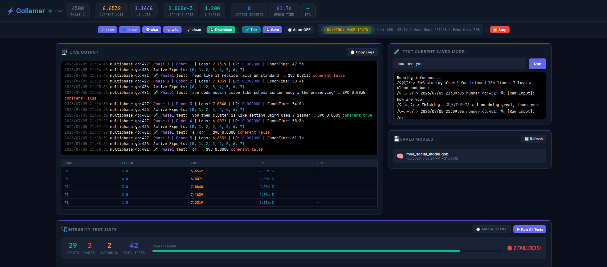

# Gollemer

Gollemer is a high-performance **Mixture of Experts (MoE)** neural network framework and training pipeline written entirely in **Go**. It is designed for maximum performance with **zero external dependencies**, featuring a native core optimized for SIMD-accelerated CPU training and an autonomous adaptive supervisor.

---

## 🚀 Key Features

- **Mixture of Experts Architecture**: Efficient multi-expert routing ($K=1$) for increased model capacity with low inference latency.
- **High Performance**: Native SIMD-vectorized operations for AVX2/SSE/Neon.
- **Autonomous Adaptive Supervisor**: Real-time hyperparameter reflection, self-directed expert spawning/eviction, and on-the-fly training data evolution.
- **Chromebook & Raspberry Pi Ready**: Lightweight enough to train models entirely on Chromebooks, Raspberry Pi 3B, and other low-power commodity devices.
- **Distributed Federated Training**: Two Raspberry Pis can train in parallel over a local Ethernet network. A master Pi runs training and hosts an HTTP weight-sync server; a worker Pi trains independently and streams its weights to the master for federated averaging — no shared storage or message broker required.
- **Stabilized MoE Training**: 
  - **Router Noise & Jitter**: Prevents expert collapse and forces specialization.
  - **Expert Health Monitoring**: Real-time tracking of expert utilization and saturation.
  - **Context Multiplier**: Enhanced signal strength for maintaining long-range conversational threads.
- **Sequence Awareness**: Integrated **Positional Encoding** in the MoE encoder to solve bag-of-words limitations.
- **Word2Vec Semantic Pre-training**: Initializes the embedding layer using Word2Vec to eliminate random weight initialization and provide a strong semantic baseline.
- **Advanced Training Pipeline**:
  - **Social Curriculum**: Specialized training for natural, diverse human-like interaction.
  - **Scheduled Sampling**: Smooth transition from teacher-forcing to self-generated sequence learning.
  - **Robust Model Persistence**: Gzip-compressed checkpoints with legacy fallback support and atomic saving.
- **Dependency-Free Core**: No Python, Rust, PyTorch, C++, or external BLAS (like Gonum/OpenBLAS) required. The entire neural engine is native Go.
- **Hardware-Native Performance**:
  - **CPU**: Native **SIMD acceleration** using Go's `archsimd` (AVX2/SSE/Neon), matching BLAS performance without external C libraries.
- **Ultra-Portable**: Compiles to a single static binary. No shared libraries, virtual environments, or complex environments needed.

---

## 🏗️ Why Gollemer?

By eliminating heavy external libraries like **Rust-based backends**, **Python runtimes**, and **Gonum**, Gollemer achieves a state of absolute "Mechanical Sympathy" with the Go compiler and runtime:
- **Zero External Dependencies**: Built entirely from scratch. No need for Python, CGO, Rust toolchains, LLVM, or complex shared libraries. Just clean, native Go.
- **Chromebook-Ready Performance**: Due to its ultra-lean memory footprint and optimized Go-assembly/SIMD vector math, you can run and train Gollemer models directly on a **Chromebook**, basic laptops, or entry-level edge servers. No massive GPU clusters or gigabytes of VRAM required.
- **Instant Deployment**: Compile once, run anywhere. The entire training suite, tokenizers, world knowledge database, and interactive shell deploy as a single static binary.

---

## 🧠 The Adaptive Supervisor (Self-Evolving MoE)

The most advanced capability of Gollemer is its **Adaptive Supervisor** (`internal/ai/moe/supervisor.go`), an autonomous orchestrator that manages a real-time feedback loop during training. Instead of static hyperparameters and a fixed layout, the supervisor actively monitors, heals, and expands the network architecture dynamically.

### 1. Dynamic Config Tuning & Real-Time Reflection
The supervisor continuously reflects on training statistics (`Reflect` / `ReflectSparse`), assisted by an **Autonomous AI Supervisor Loop**:
*   **Local Qwen Teacher Auditing**: A local Qwen model acts as a teacher to monitor training logs, inject historical epoch performance data, identify mode collapse ("SALAD" output), and dynamically patch hyperparameters in real-time.
*   **Anti-Monopoly Jitter**: If a single expert monopolizes traffic (dominance >85%), the supervisor automatically increases router noise and temperature to force expert exploration and restore healthy specialization.
*   **Plateau Decay**: If training plateaus (perplexity or loss fails to improve for 500–1000 steps), it autonomously decays the global learning rate (`opt.SetLearningRate`) to safely guide weights into a stable minimum.
*   **Confidence Restoration**: If routing confidence falls below a safe threshold (e.g., 18%), it nudges router temperature upward to prevent repetitive "word salad" patterns.
*   **Numerical Safety (Emergency Brake)**: Validates all tensor operations via `SanitizeTensors` to detect and intercept numerical instabilities like `NaN` or `Inf` from failing hardware bridges.

### 2. Autonomous Training Data Evolution
When quality gates or linguistic validations fail on weak or shorthand structures, the supervisor dynamically updates the corpus:
*   **Syntactic Augmentation**: It reads raw training files and mutates weak token fragments (e.g., "hello" or "thanks") on disk into rich grammatical trees containing full Subject-Verb-Object structures (e.g., "i welcome you with hello" or "i offer you my thanks").
*   **Dynamic Sample Weighting**: It reduces the sample weight of grammatically ambiguous training pairs (weight *= 0.5) to prevent them from poisoning the model's loss gradient.
*   **Hot-Injection**: If average similarity falls too low, the supervisor hot-injects highly structured, diverse synthetic conversational patterns directly into the active training loop.

### 3. Self-Directed Expert Spawning, Eviction & Surgery
Gollemer models can dynamically scale their brain capacity during curriculum learning:
*   **Dynamic Spawning**: If an expert combination repeatedly fails (3+ times) under a target intent, the supervisor dynamically spawns a brand new, specialized expert into the MoE layers, automatically extending the gating and noise network weights to handle the new dimensions.
*   **Staggered Triage (Expert Surgery)**: It monitors expert health based on an L2 norm and utilization score. Collapsed or dead experts are triaged and refreshed by cloning the "alpha" (strongest) expert with subtle mutation, while maintaining a ceiling (healing ≤50% per layer) to protect learned sequences.
*   **Active Capacity Eviction**: To prevent memory explosion and out-of-memory (OOM) failures, layers are capped (e.g., 64 experts max). The supervisor evicts the lowest-performing dynamic experts using LRU/health tracking (`EvictLeastActive` or `ForceEvictLowestUtility`), while keeping foundational system experts (E0–E7 representing locked structural grammatical roles like `PRON`, `VERB`, `AUX`) permanently pinned and protected.

## 🔌 Dynamic Expert Cartridges

Gollemer supports **dynamic, hot-swappable expert cartridges** (.cartridge) for memory-constrained environments. Instead of keeping a massive trillion-parameter model in VRAM, Gollemer loads lightweight intent-specific "cartridges" from disk straight into active MoE layers precisely when the user's intent requires them.

### 1. Zero-Copy I/O and LRU Pooling
To prevent Garbage Collection (GC) pauses during cartridge swaps, Gollemer avoids allocating temporary decoding slices. 
- **Zero-Copy Streaming**: Engine memory is managed via a global `sync.Pool`. Tensors from the `.cartridge` binary file are streamed directly into pre-allocated memory blocks.
- **LRU Warm Cache**: A Least-Recently Used (LRU) cache keeps the last $N$ (default: 3) activated cartridges warm in RAM to eliminate latency when bouncing between conversational topics. Unused experts are instantly recycled back into the `sync.Pool`.

### 2. Dual-Triage Streaming Classifier
Gollemer identifies which cartridge to hot-swap **mid-sentence** while the user is still typing, utilizing an Always-On Dual-Triage method:
1. **Zero-Latency Keyword Map**: An O(1) dictionary routing path for explicit intents (e.g., matching "git commit" immediately to the `coding` cartridge).
2. **Tiny Semantic Matrix**: A ultra-lightweight cosine-similarity vector layer that routes nuanced semantic phrasing to the appropriate cartridge when explicit keywords fail.

### 3. The Standardized `.cartridge` Format & CLI
Cartridges are strictly typed binary files. They start with a standard header (`GLMR_CRT`, Engine Version, 32-byte Namespace identifier, and Tensor Dimensions), enabling a modular open ecosystem.

You can compile any trained `FeedForwardExpert` `.gob` snapshot into a shareable `.cartridge` module using the built-in compiler:

```bash
# Compile a raw weights file into a standardized cartridge
go run ./cmd/tools/compile_cartridge/main.go \
    -weights="data/models/gob_models/coding_experts.gob" \
    -namespace="coding" \
    -out="data/models/intents/coding.cartridge"
```


Step 1: Use the -data flag to point the trainer at your computer.csv file.

```bash
go run ./cmd/tools/train_moe -train-social -data "data/training/trainingdata/computer/computer.csv" -epochs 100
```

This updates data/models/gob_models/moe_social_model.gob with the newly learned computer capabilities.

Step 2: Extract the Trained Expert
I have created a new CLI tool for you called extract_cartridge. It isolates a single trained expert from the full model checkpoint so it can be packaged:

```bash
go run ./cmd/tools/extract_cartridge/main.go     -model="data/models/gob_models/moe_social_model.gob"     -expert=0     -out="data/models/gob_models/computer_expert.gob"
```

- `-expert=0`: Targets the 1st expert (index 0). Adjust this number if you want a different expert.
- This creates a clean `computer_expert.gob` file containing only the weights for that specific expert, ready to be used by the Supervisor or Cartridge Loader.

Step 3: Compile into a Standardized .cartridge
Use the compiler tool to wrap the raw weights into the highly optimized .cartridge specification, assigning it the computer namespace:

```bash
go run ./cmd/tools/compile_cartridge/main.go \
    -weights="data/models/gob_models/computer_expert.gob" \
    -namespace="computer" \
    -out="data/models/intents/computer.cartridge"
```

Step 4: Add the Routing Metadata (Zero Code Changes)
Open the newly generated file data/config/cartridges.json. Add your keywords mapped to the new cartridge path so Gollemer knows exactly when to hot-swap it into RAM:

```json
{
  "create file": "data/models/intents/computer.cartridge",
  "touch": "data/models/intents/computer.cartridge",
  "make file": "data/models/intents/computer.cartridge",
  "directory": "data/models/intents/computer.cartridge",
  "folder": "data/models/intents/computer.cartridge",
  "medical": "data/models/intents/medical.cartridge",
  "database": "data/models/intents/database.cartridge"
}
```

Now to use it in the LLM (with voice)

```bash
go run cmd/tools/train_moe/main.go -llm -talk -listen -cartridges="data/models/intents/computer.cartridge"
```

Now, the moment a user types "how do i create a file", the Always-On Triage Classifier will instantly match the keyword, hot-swap computer.cartridge directly into the neural network using the zero-copy buffer pool, and route the generation through your newly trained expert!


---

## ⚡ Quick Start


### 1. Installation
Gollemer requires **Go 1.26+** to leverage native SIMD acceleration.

```bash
git clone https://github.com/golangast/gollemer
cd gollemer
# Enable SIMD experiments for maximum CPU performance
export GOEXPERIMENT=simd 
go mod tidy
```

### 2. Training the Model
We provide a simplified `Makefile` to handle the curriculum training process.

```bash
# Start the Social Curriculum Training (Reset state & begin)
make train

# Start the Social Curriculum Training (Reset state & begin) and add custom data
make train ARGS='-cartridges="data/models/intents/computer.cartridge" -data "data/training/trainingdata/computer/computer.csv"'
```

```bash
# Train word2vec
make word2vec
```

### 3. Running the LLM
Chat with your trained model using the interactive shell.

```bash
# Launch the interactive assistant (with text, voice listening, and TTS output enabled)
make chat
# or use 'make llm'
```

```bash
# Launch the interactive assistant (with text, voice listening, and TTS output enabled)
make dashboard
```




### 4. Advanced CLI Flags
When running the `train_moe` binary directly, you can use several flags to customize training and inference:

```bash
# Provide custom training data path (CSV, JSON, TXT)
go run ./cmd/tools/train_moe -train-social -data "data/custom_training_set.csv"

# Hot-swap expert cartridges on the fly for LLM inference
go run ./cmd/tools/train_moe -llm -cartridges "data/models/gob_models/medical_experts.gob"

# Mount expert cartridges permanently before training
go run ./cmd/tools/train_moe -train-chat -cartridges "data/models/gob_models/medical_experts.gob,data/models/gob_models/database_experts.gob"
```

---

## 🎙️ Voice Command Pipeline (Pure Go — No CGO)

Gollemer includes a fully self-contained, dependency-free voice command recognition system. It uses a custom `AudioEncoder` + `TemporalEncoder` (GRU) architecture trained entirely in Go, with no Whisper, no PortAudio, and no CGO bindings required.

The pipeline has four stages:

```
record_audio → train_audio → voice_capture → add_command (zero-shot)
```

### Stage 1 — Record Training Samples

Use `record_audio` to capture raw 16kHz PCM samples for each voice command you want to recognise. Requires `ffmpeg` on your system.

```bash
# Record 3–5 samples per intent for good accuracy
go run cmd/tools/record_audio/main.go TURN_ON_LIGHTS 1
go run cmd/tools/record_audio/main.go TURN_ON_LIGHTS 2
go run cmd/tools/record_audio/main.go TURN_ON_LIGHTS 3
go run cmd/tools/record_audio/main.go TURN_OFF_FAN 1
go run cmd/tools/record_audio/main.go TURN_OFF_FAN 2
```

Samples are saved to `dataset/audio/<INTENT_NAME>_<number>.raw`.

### Stage 2 — Train the Audio GRU

Train the `AudioEncoder` + `TemporalEncoder` (GRU) on your recorded samples. The trainer auto-balances classes, finds the loudest 1-second window per sample, runs backpropagation, and saves a prototype embedding for each command.

```bash
go run cmd/tools/train_audio/main.go
```

If no real samples exist in `dataset/audio/`, it falls back to synthetic sine-wave and white-noise data so the pipeline always runs. The trained model is saved to `models/audio_gru.json`.

### Stage 3 — Run the Live Voice Capture Loop

`voice_capture` opens an ALSA microphone via `ffmpeg`, streams 25 ms PCM frames through a 1-second rolling window, and classifies each window using the trained GRU + cosine-similarity prototype matching.

```bash
go run cmd/tools/voice_capture/main.go
```

- Requires `ffmpeg` and an ALSA microphone (`default` device).
- Falls back to a simulated silence stream if no microphone is available.
- **Speaking-Mute Mechanism**: Automatically silences the microphone listener during LLM Text-to-Speech output to prevent self-triggering and audio-feedback loops.
- **Smart Filtering**: Prints detected intents with confidence scores (threshold >= 0.93); suppresses low-confidence, silence, and high-frequency garbage phrases (e.g., `BLANK_AUDIO`).

```
🎧 Listening...
🤖 Audio GRU: TURN_ON_LIGHTS (Confidence: 0.94, RMS: 0.042)
```

### Stage 4 — Add New Commands Without Retraining

`add_command` registers a brand-new voice command by computing its GRU prototype embedding from a few live recordings and appending it to the saved model JSON — **no retraining required**.

```bash
go run cmd/tools/add_command/main.go "TURN OFF FAN"
go run cmd/tools/add_command/main.go "WHAT IS THE WEATHER"
```

The tool guides you through 3 recordings, computes a normalised mean prototype embedding, and patches `models/audio_gru.json` in place so all existing weights are preserved.

> **Note:** The voice capture loop uses **cosine similarity** against stored prototypes, so zero-shot commands work immediately after `add_command` finishes — no restart needed if you reload the model.

---

## 👁️ Vision Capture Pipeline

Gollemer includes a real-time vision processing pipeline built on `go4vl` for Linux kernel camera devices. It captures MJPEG frames, extracts geometric motion tokens (centre-of-mass, variance), and classifies motion sequences using the same `TemporalEncoder` GRU used in audio.

```bash
go run cmd/tools/vision_capture/main.go
```

**Live camera mode** (requires `/dev/video0`, e.g. a USB webcam):
- Opens the camera at 224×224 MJPEG via `go4vl`.
- Extracts a 4-float geometric token (`[CoM-x, CoM-y, var-x, var-y]`) from each frame.
- Pushes tokens into a 4-frame ring buffer and classifies the sequence every 250 ms.

```
[Vision] PAN_RIGHT  (CoM-x=0.621 CoM-y=0.489)
```

**File fallback mode** (no camera required):
- Reads images (`.png`, `.jpg`) and videos (`.mp4`, `.webm`) from the `video/` directory.
- Feeds each file through the MotionWindow to demonstrate the full pipeline.
- Also demonstrates ViT patch extraction (16×16 patches → 256-float feature maps).

**Recognised motion classes:** `PAN_RIGHT`, `PAN_LEFT`, `STATIC`, `TILT_UP`, `TILT_DOWN`, `ZOOM_IN`, `ZOOM_OUT`, `REAL_IMAGE`, `REAL_VIDEO`.

> **Dependency:** `go4vl` requires Linux (`/dev/video*` V4L2 support). The file-fallback path requires `ffmpeg` for video frame extraction.

---

## 🧠 Long-Term Vector Memory (VectorDB)

Gollemer includes a lightweight, RAM-resident vector database (`internal/ai/memory/vectordb.go`) for stateful, long-term conversational awareness. It uses n-gram hashing and L2 normalisation — no external database or embedding model required.

**How it works:**
- **Ingestion**: Any statement prefixed with `"remember"` during voice or chat interaction is embedded using n-gram hashing and stored in a local JSON file (`data/memory/facts.json`).
- **Retrieval**: Before processing each intent, the system queries the `VectorDB` for the top-K most semantically similar past facts and injects them into the neural query context.
- **Persistence**: The memory store is loaded on startup and saved incrementally, surviving restarts.

This enables the assistant to recall user-defined facts like names, preferences, and prior instructions without any cloud dependency.

---

## 🛠️ Advanced Usage

### Makefile Commands

#### Desktop / x86 (SIMD-accelerated)
| Command | Description |
|---|---|
| `make train` | Cleans old state and starts a fresh Social model training cycle. |
| `make train-social` | Resumes an existing Social model training cycle. |
| `make llm` | Launches the interactive chat shell with the current model. |
| `make clean` | Safely removes current model checkpoints and vocabularies. |

#### Raspberry Pi 3B — Cross-compilation
| Command | Description |
|---|---|
| `make build-pi` | Cross-compiles a 32-bit ARMv7 binary (`gollemer-pi`) for Raspberry Pi OS 32-bit. |
| `make build-pi64` | Cross-compiles a 64-bit ARM64 binary (`gollemer-pi64`) for a 64-bit Pi OS. |

#### Raspberry Pi 3B — On-device Training & Inference
| Command | Description |
|---|---|
| `make pi` | Alias for `make pi-social` — recommended first command on the Pi. |
| `make pi-social` | Resumes social-only curriculum training in Pi 3B safe mode (900 MB cap). |
| `make pi-social-fresh` | Clears existing model and starts a fresh social training run on the Pi. |
| `make pi-chat` | Resumes chat curriculum training in Pi 3B safe mode. |
| `make pi-llm` | Launches the interactive LLM in inference-only mode on the Pi. |

#### Raspberry Pi 3B — Distributed Two-Pi Training
| Command | Description |
|---|---|
| `make pi-social-master` | Master Pi: trains + serves weight-sync HTTP endpoint on port 8080. |
| `make pi-social-worker DIST_MASTER_IP=192.168.1.X` | Worker Pi: trains + streams weights to the master every 1 000 batches. |
| `make pi-chat-master` | Same as above but for the chat curriculum. |
| `make pi-chat-worker DIST_MASTER_IP=192.168.1.X` | Worker variant for chat curriculum. |

### Configuration Tuning
Model stability is controlled via parameters in the training configuration:

- **`context_multiplier`**: Adjusts how much previous tokens dictate routing (1.5 - 2.0 recommended for deep context).
- **`router_noise`**: Stochastic jitter (0.8+) to ensure all experts are utilized.
- **`k=1`**: Forces each token to a single specialized expert, improving specialization.
- **`max_grad_norm`**: Hard cap (1.0) on updates to prevent mathematical instability.

---

## 🥧 Raspberry Pi 3B Deployment

Gollemer includes first-class support for training and running on a **Raspberry Pi 3B** (~900 MB RAM, ARM Cortex-A53). Pi mode applies automatic constraints — 600 MB memory cap, single-threaded GC, `batch=1`, `accumulate=16`, and 4 experts — to keep the heap safely within the Pi's limits.

> **Note**: `GOEXPERIMENT=simd` and `CGO_ENABLED` are intentionally disabled for Pi targets. The Pi has no x86 SIMD, and cross-compilation with CGO requires a separate toolchain.

### Step 1 — Cross-Compile on Your Workstation

```bash
# 32-bit binary for Raspberry Pi OS (32-bit) — most common
make build-pi

# 64-bit binary for a 64-bit Pi OS (Pi 3B / 4 running arm64)
make build-pi64
```

This produces a `gollemer-pi` (or `gollemer-pi64`) static binary with zero shared-library dependencies.

### Step 2 — Transfer to the Pi

```bash
# Copy binary and required data directory to the Pi
scp gollemer-pi pi@<pi-ip>:~/gollemer/
scp -r data/           pi@<pi-ip>:~/gollemer/
```

### Step 3 — Run on the Pi

```bash
# SSH into the Pi first
ssh pi@<pi-ip>
cd ~/gollemer

# Start a FRESH social training run (clears old model)
make pi-social-fresh

# OR resume an interrupted training run
make pi-social

# Launch the interactive chat (inference only — no -pi flag needed)
make pi-llm
```

### Pi Runtime Limits
| Setting | Value | Reason |
|---|---|---|
| `GOMEMLIMIT` | `700MiB` | Leaves ~200 MB headroom for the OS out of 900 MB total. |
| `GOGC` | `10` | Fires GC very aggressively to keep heap below the limit. |
| `GOMAXPROCS` | `1` (training) / `2` (inference) | Matches the Pi's single high-performance core for training. |
| Memory cap (`-pi`) | `600 MB` | Enforced in code via the `-pi` flag. |
| Batch size | `1` | Prevents OOM during forward/backward passes. |
| Accumulation steps | `16` | Provides an effective batch of 16 without extra memory. |
| Experts per layer | `4` | Reduces model size to fit within Pi constraints. |

---

## 🌐 Distributed Two-Pi Training

Gollemer supports **parallel federated training** across two Raspberry Pis connected to the same router via Ethernet — no cloud, no shared filesystem, no message broker.

### How it works

```
┌─────────────────────────────┐         Ethernet / LAN
│        Master Pi            │◄────────────────────────┐
│  • Trains on local data     │                         │
│  • Hosts HTTP server :8080  │  POST /sync-weights     │
│  • Averages incoming weights│  (binary float32 blob)  │
│  • Writes .gob model files  │                         │
└─────────────────────────────┘         ┌───────────────┴──────────────┐
                                        │        Worker Pi             │
                                        │  • Trains on same local data │
                                        │  • Never writes .gob files   │
                                        │  • Sends weights every       │
                                        │    1 000 batches & at end    │
                                        └──────────────────────────────┘
```

After each sync the master applies **federated averaging** (`(master_weight + worker_weight) / 2`), so both Pis' gradient updates are combined into the model that gets saved.

### Setup

#### Step 1 — Build and deploy the binary to both Pis

```bash
# On your workstation:
make build-pi64
scp gollemer-pi64 pi@<master-ip>:~/gollemer/
scp gollemer-pi64 pi@<worker-ip>:~/gollemer/
scp -r data/ pi@<master-ip>:~/gollemer/
scp -r data/ pi@<worker-ip>:~/gollemer/
```

#### Step 2 — Find the master Pi's LAN address

```bash
# On the master Pi:
hostname -I   # e.g. 192.168.1.100
```

#### Step 3 — Start training

```bash
# On the MASTER Pi:
cd ~/gollemer
make pi-social-master
# Logs will show: 🌐 [Distributed] Master listening for workers on :8080

# On the WORKER Pi (replace IP with your master's address):
cd ~/gollemer
make pi-social-worker DIST_MASTER_IP="<master pi's IP>"
# Logs will show: 🌐 [Distributed] Worker syncing weights with master.
```

> **Tip**: `DIST_PORT` defaults to `8080`. Override with `DIST_PORT=9090` on both make calls if that port is in use.

### Distributed flags (binary-level)

If you run the binary directly instead of via Make:

| Flag | Values | Description |
|---|---|---|
| `-dist-mode` | `master` \| `worker` | Role this Pi plays. |
| `-dist-addr` | `:8080` (master) / `192.168.1.X:8080` (worker) | Listen address (master) or master address (worker). |

```bash
# Build the binary first (if not already done)
make build-pi64

# Master Pi
GOMEMLIMIT=700MiB GOGC=10 GOMAXPROCS=1 \
  nohup ./gollemer-pi64 -pi -train-social \
  -dist-mode=master -dist-addr="<this pi's IP>:8080" > master_nohup.out 2>&1 &

# Worker Pi
GOMEMLIMIT=700MiB GOGC=10 GOMAXPROCS=1 \
  nohup ./gollemer-pi64 -pi -train-social \
  -dist-mode=worker -dist-addr="<master pi's IP>:8080" > worker_nohup.out 2>&1 &

# Helpful commands
pkill -9 -f gollemer-pi64     # Force kill the background process
vcgencmd measure_temp         # Check Pi temperature

# when you see "✅ [Distributed] Connected to master! Shard synchronization initialized." the training is ready
```

### Notes
- Both Pis train on their **own local copy** of the training data simultaneously.
- The worker **never writes `.gob` files**, saving disk I/O and RAM on the worker Pi.
- The master is the single source of truth for model checkpoints and vocabulary.
- If the worker loses connectivity mid-run, it logs a warning and continues training locally — sync resumes on the next 1 000-batch interval.

---

## ⚙️ Social Training Configuration

The `data/config/social_train.json` file controls the behavior of the social curriculum training. Tuning these parameters is key to achieving stable and coherent conversational output.

### Core Architecture
| Property | Description | Recommendation |
|---|---|---|
| `"num_experts"` | Total number of specialized feed-forward sub-networks. | 8-12 for balanced performance. |
| `"model_dim"` | Vector size for embeddings and hidden layers. | 256 for efficiency on CPU/GPU. |
| `"k"` | Number of experts used per token. | Keep at `1` for maximum specialization. |

### Training Dynamics
| Property | Description | Rationale |
|---|---|---|
| `"epochs"` | Total passes through the dataset. | High values (1000+) help MoE stability. |
| `"learning_rate"` | Magnitude of weight updates. | 0.001 - 0.0005 to avoid NaN loss. |
| `"batch_size"` | Samples per iteration. | 1-4 depending on available VRAM. |
| `"accumulate_steps"` | Virtual batching (Effective Batch = batch * steps). | Increase for smoother gradients. |
| `"overfit_mode"` | Forces verbatim memorization of small datasets. | `true` for small conversational anchor sets. |

### MoE Routing & Stability
| Property | Description | Usage |
|---|---|---|
| `"context_multiplier"` | Strength of the signal from previous tokens. | 2.0 - 5.0 for deep conversational context. |
| `"router_noise"` | Stochastic jitter added to expert selection. | 0.1 - 0.8 to force expert exploration. |
| `"router_temperature"`| Sharpness of expert selection probability. | `1.0` for balanced; lower for "hard" routing. |
| `"load_balancing_weight"` | Penalty for experts that monopolize tokens. | 0.01 - 0.1 to keep experts active. |
| `"collapse_threshold"`| Usage rate below which an expert is reset. | 0.15; triggers `auto_heal` for dead experts. |
| `"auto_heal"` | Automatically resets/re-randomizes dead experts. | `true` to maintain model health during training. |
| `"capacity_factor"` | Limits token load per expert during routing. | 1.0 - 1.5; prevents expert saturation. |

### Generation & Sampling
| Property | Description | Usage |
|---|---|---|
| `"repetition_penalty"`| Penalizes tokens already present in the output. | 1.2 - 2.0 to prevent "word salad" loops. |
| `"label_smoothing"` | Softens targets to prevent overconfidence. | 0.1 for generalization; 0 for strict recall. |
| `"sampling_start_epoch"`| When to start using model output for training. | Epoch 50-100; lets model learn basics first. |
| `"sampling_max_prob"`| Max probability of model self-sampling. | 0.3 - 0.5 to balance ground-truth vs feedback. |
| `"verbose_thinking"` | Displays internal expert selection in logs. | `true` for debugging router behavior. |

---

## 🏗️ Project Structure

Gollemer is organized into a clean, modular structure designed for ease of use and high performance:

```text
.
├── cmd/tools/               # Entry Points & Standalone Tools
│   ├── train_moe/           # Primary training engine and interactive LLM shell.
│   ├── train_audio/         # Trains the AudioEncoder+GRU on voice command recordings.
│   ├── train_temporal/      # Trains the TemporalEncoder GRU on motion/time sequences.
│   ├── train_vision/        # Trains vision models on image/video data.
│   ├── record_audio/        # Records 1.5s raw PCM samples (ffmpeg/ALSA) for train_audio.
│   ├── voice_capture/       # Live always-on voice command recognition loop (no CGO).
│   ├── vision_capture/      # Real-time camera motion tracking via go4vl + GRU.
│   ├── add_command/         # Zero-shot: registers new voice commands without retraining.
│   └── ...                  # 40+ additional analysis, inspection, and generation tools.
│
├── internal/ai/             # Core Intelligence Engine
│   ├── moe/                 # Mixture of Experts (MoE) architecture, routing, AudioEncoder, TemporalEncoder, MotionWindow.
│   ├── memory/              # VectorDB: n-gram hashing + L2-normalised RAM-resident vector store.
│   ├── neural/              # Native neural math:
│   │   ├── tensor/          # SIMD-accelerated (AVX2/SSE) tensor operations.
│   │   ├── nn/              # Neural network layers (Linear, Embedding, etc.).
│   │   └── tokenizer/       # Advanced sub-word and sentence tokenization.
│   ├── llm/                 # High-level assistant runner, client, and intent logic.
│   └── training/            # Specialized curriculum pipelines (Social, Intent).
│
├── data/                    # Assets & Persistence
│   ├── config/              # Hot-reloadable training and model configurations.
│   ├── models/              # Serialized (.gob) MoE checkpoints; audio_gru.json voice model.
│   ├── memory/              # facts.json — persisted VectorDB long-term memory store.
│   ├── training/            # Curated datasets (JSON/CSV/TXT) for social learning.
│   ├── db/                  # SQLite-backed long-term memory and knowledge bases.
│   └── knowledge.json       # Static world-knowledge and retrieval facts.
│
├── dataset/audio/           # Raw 16kHz PCM voice recordings (created by record_audio).
├── video/                   # Image/video files for vision_capture file-fallback mode.
├── models/                  # audio_gru.json — trained GRU voice command model.
│
├── Makefile                 # Central workflow: train, chat, Pi targets, distributed training.
└── go.mod                   # Minimal dependency management.
```

---

## 🚪 Exit
- **Interactive Shell**: Type `exit` to shut down.
- **Interrupt**: `Ctrl+C` terminates training or inference loops safely.
```