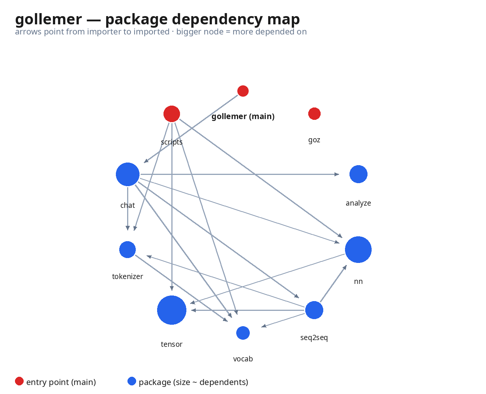

# Gollemer 🤖

A tiny LLM written in **pure Go** — zero external dependencies.
One chat, six brains: every message is routed to the right one.

```
 ┌────────────────────────────────────────────────────────────────────┐
 │                             make chat                              │
 │                                                                    │
 │ you> analyze this project                                          │
 │            │                                                       │
 │            ▼                                                       │
 │      ┌─────────────┐                                               │
 │      │   router    │─── which brain should answer?                 │
 │      └──────┬──────┘                                               │
 │             │                                                      │
 │       ┌─────────┬─────────┬─────────┬──────────┬───────────┐       │
 │       ▼         ▼         ▼         ▼          ▼           ▼       │
 │   ┌──────┐ ┌────────┐ ┌───────┐ ┌───────┐ ┌────────┐ ┌──────────┐  │
 │   │social│ │  go    │ │gocode │ │ gocli │ │makefile│ │goanalyze │  │
 │   │ chat │ │concepts│ │writes │ │English│ │"how do │ │reads Go  │  │
 │   │      │ │        │ │Go code│ │→go cmd│ │ i..."  │ │codebases │  │
 │   └──────┘ └────────┘ └───────┘ └───────┘ └────────┘ └──────────┘  │
 │                          │                                         │
 │                          ▼                                         │
 │   gollemer [goanalyze]> Project: github.com/golangast/gollemer     │
 └────────────────────────────────────────────────────────────────────┘
```

The tag (`[go]`, `[social]`, …) always shows which brain answered.

---

## 🚀 Start here

```sh
make start     # the start-here guide (what to do, what it can do, how to expand it)
make chat      # talk to it — clean replies only
make debug-chat # talk to it with the thought process + debug prints shown
```

Try one prompt from each brain:

| Try saying…                              | Brain      | What happens                              |
|------------------------------------------|------------|-------------------------------------------|
| `have you ever played soccer`            | social     | chit-chat, remembers the session          |
| `what is a goroutine`                    | go         | explains the Go concept                   |
| `write a function that sums a slice`     | gocode     | writes Go code (never chats)              |
| `what command formats my code`           | gocli      | gives the exact `gofmt` command, asks [y/n] before running |
| `how do i chat with gollemer`            | makefile   | suggests `run make chat`                  |
| `analyze this project`                   | goanalyze  | maps the codebase — packages, engine room, reading order (see below) |

```sh
make sel       # browse every command in a fuzzy finder (see below)
make explain   # full project overview + command reference
```

---

## 🔍 goanalyze — point it at any Go codebase

The sixth brain doesn't guess — it **reads**. It parses real Go source
with the standard library's `go/ast`, builds a call graph, and tells you
how a project works and exactly where to change it. It's deterministic:
no neural net, so it can't hallucinate structure that isn't there.

```
 you say                          →  gollemer does
 ─────────────────────────────────────────────────────────────────
 analyze this project               maps the repo you're chatting in
 /analyze ~/path/to/project         maps a folder on disk (~ works)
 analyze github.com/owner/repo      shallow-clones it (cached) and maps it
 where would I add a retry helper   ranked file:line hits, using the last
                                    analyzed project
 analyze this project and           everything above, plus an interactive
   show me a visual                 HTML report you can open in a browser

Then just **ask questions** about the code — it answers from what it
actually parsed, with file:line pointers:

 you> what does routeDomain do      signature, doc, callers, callees
 you> how does NewTensor work       step-by-step through what it calls
 you> what calls NewTensor          every caller, with file:line
 you> where is Project defined      definition site
 you> show me routeDomain           the actual source code
 you> what's in package chat        what the package is for + key functions
 you> where is saving handled       keyword search → ranked file:line hits
```

Questions only trigger when they name something really in the project,
so `what does a goroutine do` still goes to the Go brain and
`what does make chat do` still goes to the makefile brain.

Point it at itself and you get this (real output):

```
you> analyze this project
gollemer [goanalyze]> Project: github.com/golangast/gollemer
10 packages, 85 Go files, ~20278 lines
Entry points:
  - cmd/tools/goz/main.go
  - main.go
  - scripts/stats_viewer.go
22 test files

IN PLAIN ENGLISH
gollemer is a runnable Go program: 10 packages, about 20,278 lines of
Go. It starts in main.go. The hardest-working function is
tensor.NewTensor, called from 62 places — that's the engine room, the
best place to look when something breaks. Read the code in this order:
goz → analyze → vocab → tensor → nn → tokenizer, because each layer
builds on the one before it.

ENGINE ROOM (most-called functions)
████████████████████ tensor.NewTensor (62 callers)
████ analyze.Func.Display (13 callers)
████ analyze.Project.Answer (11 callers)
███ vocab.Vocabulary.AddToken (9 callers)
███ nn.NewLinear (8 callers)
...

WHERE TO START
1. Start at the entry point:  main.go:13 — func main
2. Then read the engine room:  tensor.NewTensor (62 callers)
3. Learn the key types:        tensor.Operation — interface, 42 implementers
4. Package reading order (dependencies first):
   1. cmd/tools/goz
   2. internal/ai/analyze
      Package analyze reads a Go project off disk and builds a
      structural map of it: packages, exported API, a heuristic call
      graph, and the import graph.
   3. internal/ai/neural/nnu/vocab
   4. internal/ai/neural/tensor
   ...
```

And the map it drew of itself — bigger node = more packages depend on it,
red = entry point, arrows run importer → imported:



Follow-ups reuse the last analyzed project, so you can drill in:

```
you> where would I add a new brain
gollemer [goanalyze]> WHERE TO CHANGE for "add a new brain"
1. struct chat.domainTrainData  internal/ai/training/chat/real_seq2seq_train.go:59
2. func chat.routeDomain         internal/ai/training/chat/dataset.go:541  (5 callers)
3. func chat.loadRealModel       internal/ai/training/chat/real_seq2seq_chat.go:120
...
```

And once you've found a name, interrogate it — this is the part that
makes a new codebase editable instead of just mappable:

```
you> what does routeDomain do
gollemer [goanalyze]> func routeDomain(input string) string
  internal/ai/training/chat/dataset.go:541
  routeDomain classifies a chat INPUT (not the output) into the domain
  model that should handle it.
  Calls (2): chat.isGoCliRequest, chat.isGoCommandQuestion
  Called by (5): chat.runUnifiedChat, ...

you> how does NewTensor work
gollemer [goanalyze]> func NewTensor(shape []int, data []float32,
                                     requiresGrad bool) *Tensor
  internal/ai/neural/tensor/tensor.go:293
  NewTensor creates a new Tensor with the given shape and optional
  data on the CPU.
  Called by (62): seq2seq.Encoder.Forward, seq2seq.TrainBatch, ...

you> show me routeDomain
gollemer [goanalyze]> chat.routeDomain  (internal/ai/training/chat/dataset.go:541)
  ```go
  func routeDomain(input string) string {
      // Definition questions about Gollemer itself ("what is gollemer",
      // "who made you") are conversational, not make-command requests,
      // even though they name Gollemer. Checked before makefileIntent.
      if gollemerDefinition.MatchString(input) {
          return SocialDomain
      }
      ...
  ```
```

Notes:

- `show me a visual` writes a standalone interactive page (SVG graph you
  can pan around) to `~/workspace/your_files/codebase-maps/<project>.html`.
- GitHub repos are cloned once into `~/workspace/codebase-maps/` and
  reused on later runs.
- The call graph is name-based (heuristic) — great for finding hot spots
  and navigation paths, not compiler-grade call resolution.

---

## 🎯 `make sel` — the command picker

Don't remember the command names? `make sel` lists every target in
columns. Start typing to fuzzy-filter, pick with the arrow keys, and
it runs:

```
 ┌─ make sel ─────────────────────────────────────┐
 │ > cha                                          │
 │   chat            Talk to gollemer…            │
 │   train-chat      …                            │
 └────────────────────────────────────────────────┘
         │ you pick "chat"
         ▼
   runs: go run . -real-chat -domain unified
```

It reads the `## target: description` comments straight out of the
`Makefile`, so the list is never out of date.

---

## ⌨️ Commands

| Command             | What it does                                              |
|---------------------|-----------------------------------------------------------|
| `make start`        | Start-here guide                                          |
| `make chat`         | Talk to Gollemer — one session, six brains, clean replies only |
| `make debug-chat`   | Talk to Gollemer with the thought process + debug prints shown |
| `make sel`          | Pick a command from a columnar fuzzy finder               |
| `make explain`      | Project overview + what each command does                 |
| `make smarter`      | The one-command upgrade: more data → retrained brains → evals → report |
| `make eval`         | Score every brain on its fixed eval suite                 |
| `make train-social`   | Retrain the social brain (128/256 dims)                 |
| `make train-go`       | Retrain the Go concept brain (128/256 dims)             |
| `make train-gocode`   | Retrain the Go code brain (256/512 dims + copy gate)    |
| `make train-gocli`    | Retrain the Go CLI command brain (128/256 dims)         |
| `make train-makefile` | Retrain the makefile command brain (128/256 dims)       |
| `make import FILE=pairs.jsonl` | Import new training pairs through the quality gate |
| `make help`         | List the commands                                         |

---

## 🧠 How it learns

```
 ┌──────────────┐
 │ you write    │
 │ Q&A pairs    │   {"input": "what is a slice",
 │ (JSONL)      │    "output": "a dynamic view into an array...",
 │              │    "domain": "go"}
 └──────┬───────┘
        │ make import FILE=pairs.jsonl
        ▼
 ┌──────────────┐
 │ quality gate │─── bad pairs quarantined (never trained on)
 └──────┬───────┘
        │ good pairs admitted
        ▼
 ┌──────────────────────────────┐
 │ data/training/chat_pairs.jsonl │  ← the one dataset (1,800+ pairs)
 └──────┬───────────────────────┘
        │ make train-go / make smarter
        ▼
 ┌──────────────┐     ┌──────────────┐
 │  retrained   │────▶│  make eval   │─── did the new knowledge stick?
 │  brain (.gob)│     │  fixed suite │
 └──────────────┘     └──────────────┘
```

Four safety nets keep answers reliable:

- **Recall layers** — exact training questions get their trained answer
  verbatim (social + makefile). The tiny net doesn't have to memorize.
- **Go knowledge base** — ~50 curated Go facts answer before the neural
  net is even asked.
- **goanalyze is deterministic** — codebase questions are answered by
  parsing real ASTs, never by a model. Structure can't be hallucinated.
- **Mode separation** — the code brain can never chat and the chat brain
  can never emit code. No `I am func doing (x)` mush, by construction.

---

## 📁 Project layout

```
gollemer/
├── main.go                     # entry point: -real-chat, -train-*, -import
├── Makefile                    # all commands (make help / make sel / make start)
├── README.md                   # this file
├── docs/codebase-map.png       # dependency map shown in this README
├── go.mod                      # zero dependencies — stdlib only
│
├── scripts/
│   ├── start.sh                # make start — the start-here guide
│   ├── explain.sh              # make explain — project + command reference
│   ├── smarter.sh              # make smarter — the one-command upgrade
│   ├── *_eval_run.py           # fixed eval suites per brain
│   └── *_eval_cases.json       # eval prompts + expected answers
│
├── cmd/
│   └── tools/
│       ├── goz/                # the fuzzy finder behind make sel
│       ├── moe_inference/      # run a model from the CLI
│       └── ...                 # one-off data + debug utilities
│
├── internal/ai/
│   ├── analyze/                # 🔍 goanalyze: AST codebase reader (deterministic)
│   │   ├── analyze.go          # parses Go source into packages/functions/types
│   │   ├── deep.go             # plain-English summaries, signatures, overviews
│   │   ├── qa.go               # answers "what does X do" about the code
│   │   ├── graph.go            # heuristic call graph + engine-room ranking
│   │   ├── report.go           # summary / reading guide / where-to-change
│   │   └── html.go             # standalone SVG visual report
│   ├── moe/                    # mixture-of-experts layers (pure Go)
│   ├── neural/
│   │   ├── nn/                 # tensors, autograd, optimizers
│   │   ├── nnu/seq2seq/        # the seq2seq model
│   │   └── nnu/vocab/          # tokenizer + vocabulary
│   ├── training/chat/          # ⭐ the brains live here
│   │   ├── real_seq2seq_chat.go  # chat loops (unified + single-domain)
│   │   ├── real_seq2seq_train.go # training (dims, epochs, checkpoints)
│   │   ├── dataset.go            # router: which brain gets this message?
│   │   ├── goknowledge.go        # curated Go facts (answered first)
│   │   ├── socialrecall.go       # exact-match answers: social
│   │   ├── makefilerecall.go     # exact-match answers: makefile
│   │   ├── conversation.go       # session memory (/history, /forget)
│   │   ├── goanalyze.go          # 6th brain: analyze paths/URLs, /analyze command
│   │   └── *_test.go             # router, recall, knowledge, routing tests
│   └── ...
│
└── data/
    ├── training/
    │   ├── chat_pairs.jsonl      # ⭐ the one dataset — every brain's Q&A
    │   └── *_20260929.jsonl      # expansion batches (imported via quality gate)
    └── models/
        └── gob_models/
            ├── real_tiny_seq2seq_social.gob     # chat brain
            ├── real_tiny_seq2seq_go.gob         # Go concepts brain
            ├── real_tiny_seq2seq_gocode.gob     # Go code brain
            ├── real_tiny_seq2seq_gocli.gob      # Go CLI brain
            └── real_tiny_seq2seq_makefile.gob   # makefile brain
```

### Where to look for what

| You want to…                        | Look at                                          |
|-------------------------------------|--------------------------------------------------|
| Change how messages get routed      | `internal/ai/training/chat/dataset.go` (`routeDomain`) |
| Change what a brain knows           | `data/training/chat_pairs.jsonl` + `make import` |
| Fix a wrong deterministic answer    | `goknowledge.go`, `socialrecall.go`, `makefilerecall.go` |
| Change how codebases get analyzed    | `internal/ai/analyze/` (`report.go` renders the answers) |
| Tune training (dims, epochs)        | `real_seq2seq_train.go` (`dimsForDomain`)        |
| Change the chat UI (`/history`, …)  | `real_seq2seq_chat.go`, `conversation.go`        |
| Add a command                       | `Makefile` (`## name: description` — `sel` picks it up automatically) |

---

## 🔧 Teach it something new

```sh
# 1. write pairs (one JSON object per line)
cat > my_pairs.jsonl << 'EOF'
{"input": "what is a map in go", "output": "a map is go's hash table: keys to values...", "domain": "go"}
EOF

# 2. import through the quality gate
make import FILE=my_pairs.jsonl

# 3. retrain the brain
make train-go

# 4. check it stuck
make eval
```

Or do it all at once: `make smarter`.

---

## 📊 Current state

- **Pure Go, zero dependencies** (`go.mod` has no `require` block)
- **6 brains**, 1,900+ training pairs, seq2seq + 4-expert MoE
- Social: multiturn 9/10 · Go concepts: curated KB + neural · Gocode: 16/17 ·
  Gocli: 16/16 · Makefile: deterministic recall + neural fallback ·
  Goanalyze: deterministic AST analysis, zero training needed
